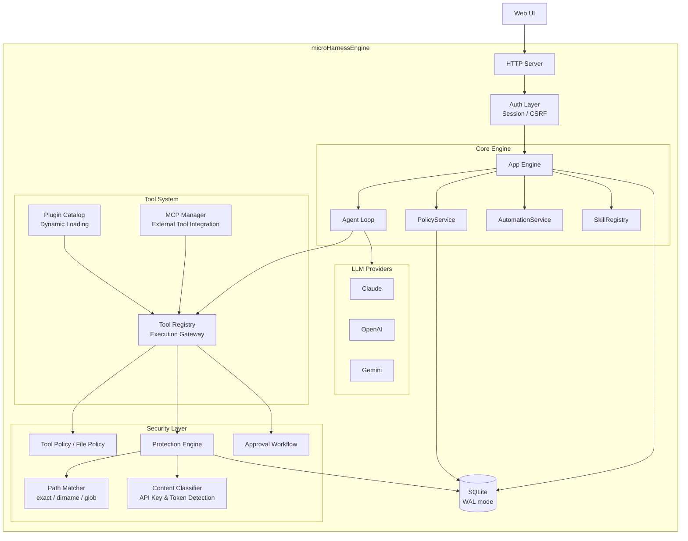

English | [日本語](./README.ja.md)

<p align="center">
  <h1 align="center">microHarnessEngine</h1>
  <p align="center"><strong>Policy-Driven Secure AI Assistant Engine</strong></p>
  <p align="center">
    <a href="./LICENSE">MIT License</a> ·
    <a href="./docs/en/index.md">Documentation</a> ·
    <a href="./docs/en/getting-started.md">Getting Started</a>
  </p>
</p>

---

AI assistant security is evolving rapidly.
Confirmation prompts, sandboxes, `.gitignore`-based exclusions — each tool takes its own approach.

However, many AI assistants start from a design that **"allows everything first, then restricts what's dangerous."**

**microHarnessEngine** takes the opposite approach.

```
Default Allow:  Permit everything → Restrict dangerous things later
Default Deny:   Deny everything → Explicitly permit only what's needed
```

In the initial state, no permissions are granted. Which tools can be used and which files can be accessed are explicitly permitted per user through policies. And protection of sensitive information is enforced at the code level, not relying on prompt compliance.

Many AI assistants are designed with the assumption that **"one user uses it for themselves."**

microHarnessEngine is different. It is a foundation engine designed to be **deployed for a single project or team.**

Set different permissions for each member, require team approval workflows for dangerous operations — it functions as **team infrastructure**, not a personal tool.

Just as you can build a custom blog on top of WordPress, you can build a project-specific AI assistant on top of microHarnessEngine.

> It works as a regular AI assistant out of the box. Customize when you need to.

---

## Design Philosophy

| Principle | Approach |
|---|---|
| **Default Deny** | No permissions are granted to new users. Permissions must be explicitly allowed via policy |
| **Code-Level Protection** | Sensitive information blocking is enforced by the execution engine, not relying on LLM prompt compliance |
| **Per-User Access Control** | Tool usage permissions and file access scope are configured per user |
| **Approval Workflow** | Destructive operations pause the agent and require human approval before execution |
| **Provider Agnostic** | Switch between Claude / OpenAI / Gemini via `.env`. No vendor lock-in |
| **Policy-Managed MCP** | External MCP server tools are integrated under the same policy engine |

---

## 3-Layer Defense — Security That Doesn't Rely on LLM Prompt Compliance

A prompt instruction like "don't read `.env`" can be overridden by prompt injection.
microHarnessEngine protects information with **3 layers of defense enforced at the code level**, not relying on LLM behavioral guidelines.

### Layer 1: Don't Reveal Its Existence to the LLM

Protected items are blocked at **every surface** where the LLM touches information.

| Blocking Point | Behavior |
|---|---|
| **Tool Definitions** | Only tools permitted by policy are included in the LLM's schema. Unpermitted tools are invisible to the LLM |
| **Directory Listings** | Protected items are excluded from `list_files` results. The LLM can't even see that the file exists |
| **Search & Glob** | Protected items are excluded from search results and pattern match results |
| **Conversation History** | Sensitive patterns in past conversation history are redacted before sending to the LLM |

### Layer 2: Don't Execute Even If Requested

Tool execution must pass through **multiple independent gates** in series.

```
Tool Execution Request
  │
  ├─ Gate 1: Tool Policy ── Is the user permitted to use this tool?
  │
  ├─ Gate 2: File Policy ── Is the target path within the user's access scope?
  │
  ├─ Gate 3: Protection Rules ── Evaluate protection rules per action (read/write/delete/discover)
  │                               Pattern matching (exact/dirname/glob) + priority control
  │
  └─ Gate 4: Approval ── Pause the agent for destructive operations and wait for human approval
```

If any single gate denies the request, execution does not proceed.

### Layer 3: Don't Pass Execution Results to the LLM

Even if a tool executes, output is **redacted in 3 stages**.

| Stage | Behavior |
|---|---|
| **Tool Results** | Content Classifier scans output. Replaces 6 pattern types (API keys, tokens, PEM private keys, etc.) with `[REDACTED: api_key]` |
| **Before LLM Return** | Sanitizes the entire conversation message before sending to the LLM |
| **Before DB Save** | Applies redaction before persisting to database. No sensitive information left in logs |

### Each Layer Operates Independently

**Even if one layer is breached, the remaining layers protect the information.**
All denial decisions are recorded in **audit logs**, enabling post-incident verification of which rules were triggered.

---

## Key Features

### Security

- **Default Deny** — No permissions granted to new users
- **Tool Policy** — Whitelist-based control of available tools per user
- **File Policy** — Path-based access control per user
- **Protection Engine** — Path-based + content-based sensitive information protection
- **Approval Workflow** — Destructive operations wait for human approval

### Platform

- **Multi-Provider** — Switch between Claude / OpenAI / Gemini via `.env`
- **MCP Integration** — Integrate external MCP server tools under policy management
- **Plugin Architecture** — Add tools as plugins
- **Web Admin Console** — Manage all security settings via GUI

### Agent

- **Agent Loop** — Autonomous LLM ↔ tool execution loop
- **Auto Recovery** — Automatic recovery and resumption on errors
- **Automation** — Create scheduled tasks from chat using natural language
- **Skills** — Markdown-based custom prompt templates

---

## Three Ways to Make It Your Own

microHarnessEngine is extensible through **3 layers.**
Each takes just minutes to add, and all operate under security policy management.

### Tool Plugins — Just Drop a JS File

Create a folder in the `tools/` directory and write a tool definition.
It's automatically detected and registered on server startup.

```js
// tools/my-plugin/index.js
export const plugin = {
  name: 'my-plugin',
  tools: [{
    name: 'hello_world',
    description: 'Say hello',
    input_schema: { type: 'object', properties: {} },
    async execute() { return { ok: true, result: 'Hello!' } }
  }]
}
```

Security features like path resolution, approval workflows, and protection checks are provided as `context.helpers`, so tool developers can focus on business logic.

### Skills — Just Write Markdown

Place `.md` files in `skills/` and they become knowledge the LLM can reference.
No code required, no schema required, no restart required.

```
skills/
└── deploy-guide.md    ← Active just by placing it
└── review-checklist.md
```

Team best practices, coding standards, deployment procedures — documents become your AI assistant's "knowledge" as-is.

### MCP Integration — Just Configure JSON

Add external MCP server tools to `mcp.json` for integration. Uses Claude Desktop-compatible format — no code needed.

```json
{
  "mcpServers": {
    "github": {
      "command": "npx",
      "args": ["-y", "@modelcontextprotocol/server-github"],
      "env": { "GITHUB_TOKEN": "ghp_xxxx" }
    }
  }
}
```

Supports both stdio and HTTP. Once connected, tools are automatically registered and available under the same policy management as built-in tools.

---

## Architecture



All tool executions **must pass through the Security Layer.** MCP-integrated tools are no exception.

---

## Quick Start

```bash
git clone https://github.com/m-harness/micro-harness-engine.git
cd micro-harness-engine
npm install
```

Create `.env`:

```env
LLM_PROVIDER=anthropic
ANTHROPIC_API_KEY=sk-ant-...
ADMIN_RUNTIME_PASSWORD=your-admin-password
```

```bash
npm start
```

| URL | Purpose |
|---|---|
| `http://localhost:4310/` | Chat UI |
| `http://localhost:4310/admin` | Admin Console |

### Development Mode

Start the backend API and Web UI dev server simultaneously:

```bash
npm run dev:full
```

| URL | Purpose |
|---|---|
| `http://localhost:4173/` | Web UI (Vite HMR enabled, API auto-proxied) |
| `http://localhost:4310/` | Backend API (auto-reload on file changes) |

### First Steps

1. Log in to the admin console (`root` / your configured password)
2. Create a user
3. Create a Tool Policy and select the tools to allow
4. Assign the Policy to the user
5. Log in to the Chat UI and start using it

See [Getting Started](./docs/en/getting-started.md) for details.

---

## Use Cases

### AI Assistant for Team Development

```
Junior Engineer  → read_file, search only
Senior Engineer  → All file operations + git operations
Team Lead        → All tools + MCP integration
```

Fine-grained per-user permission control. No risk of a junior accidentally breaking production configs.

### Automated Reports & Scheduled Tasks

Create Automations from chat using natural language like "Check disk usage every morning at 9am and create a report." The scheduler runs them automatically.

### Secure MCP Server Integration

Tools provided by external MCP servers are integrated under microHarnessEngine's policy management. Control which users can use each tool.

---

## Documentation

| Document | Description |
|---|---|
| **[Getting Started](./docs/en/getting-started.md)** | Installation, initial setup, first chat |
| **[Architecture](./docs/en/architecture.md)** | System structure, components, processing flow |
| **[Security Model](./docs/en/security.md)** | 3-layer defense, Protection Engine, sensitive info detection |
| **[Policy Guide](./docs/en/policy-guide.md)** | How Tool Policy / File Policy work and how to configure them |
| **[Agent Loop](./docs/en/agent-loop.md)** | Agent loop, approval workflow, auto recovery |
| **[Tools](./docs/en/tools.md)** | Built-in tool list, plugin development guide |
| **[MCP Integration](./docs/en/mcp-guide.md)** | MCP server connection, configuration, management |
| **[Admin Guide](./docs/en/admin-guide.md)** | Complete guide to the admin console |
| **[Configuration](./docs/en/configuration.md)** | All environment variables and settings reference |
| **[API Reference](./docs/en/api-reference.md)** | All REST API endpoints |
| **[Data Model](./docs/en/data-model.md)** | Database schema and ER diagrams |

---

## Tech Stack

| Component | Technology |
|---|---|
| Runtime | Node.js |
| Database | SQLite (better-sqlite3, WAL mode) |
| Admin UI | React + Vite |
| LLM | Anthropic Claude / OpenAI / Google Gemini |
| External Tools | MCP (Model Context Protocol) |

---

## License

[MIT License](./LICENSE) — Copyright (c) 2024-2026 microHarnessEngine contributors


This project is maintained on a best-effort basis.

- Issues are welcome, but we may not be able to respond to or address all of them.
- Pull Requests are welcome, but may not always be accepted.
- For large changes, please discuss before implementing.
