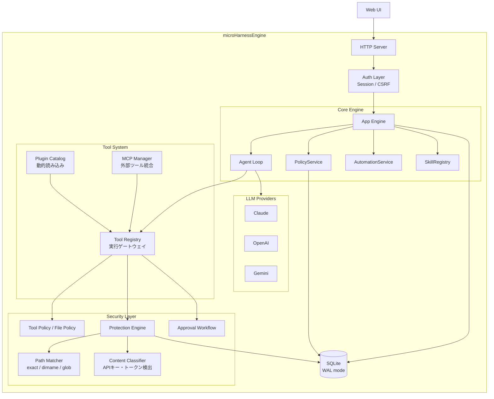

<p align="center">
  <h1 align="center">microHarnessEngine</h1>
  <p align="center"><strong>Policy-Driven Secure AI Assistant Engine</strong></p>
  <p align="center">
    <a href="./LICENSE">MIT License</a> ·
    <a href="./docs/index.md">Documentation</a> ·
    <a href="./docs/getting-started.md">Getting Started</a>
  </p>
</p>

---

AIアシスタントのセキュリティは急速に進化しています。
確認プロンプト、サンドボックス、`.gitignore` ベースの除外 — 各ツールがそれぞれのアプローチで対策を進めています。

しかし、多くのAIアシスタントは **「まず許可し、危険なものを制限する」** という設計が出発点にあります。

**microHarnessEngine** は逆のアプローチを取ります。

```
Default Allow:  すべて許可 → 危険なものを後から制限
Default Deny:   すべて拒否 → 必要なものだけ明示的に許可
```

初期状態では何の権限もありません。どのツールを使えるか、どのファイルにアクセスできるかを、ユーザーごとにポリシーで明示的に許可します。そして、機密情報の保護はプロンプトの遵守に頼らず、コードレベルで強制します。

多くのAIアシスタントは **「1人のユーザーが自分のために使う」** ことを前提に設計されています。

microHarnessEngineは違います。**1つのプロジェクト、1つのチームに導入する**ことを想定した基盤エンジンです。

メンバーごとに異なる権限を設定し、危険な操作にはチームの承認フローを挟む — 個人ツールではなく、**チームのインフラ**として機能します。

WordPressの上にオリジナルのブログを構築するように、microHarnessEngineの上にプロジェクト専用のAIアシスタントを構築できます。

> そのままでも通常のAIアシスタントとしてすぐに使えます。カスタマイズは必要になってから。

---

## microHarnessEngineの設計思想

| 設計方針 | アプローチ |
|---|---|
| **Default Deny** | 新規ユーザーには何の権限も付与しない。ポリシーで明示的に許可する |
| **コードレベルの保護** | 機密情報の遮断をLLMのプロンプト遵守に依存せず、実行エンジン側で強制する |
| **ユーザー別の権限制御** | ツールの使用許可・ファイルアクセス範囲をユーザーごとに設定 |
| **承認ワークフロー** | 破壊的操作はエージェントを一時停止し、人間の承認を経てから実行する |
| **プロバイダ非依存** | Claude / OpenAI / Gemini を `.env` で切り替え。特定ベンダーに依存しない |
| **ポリシー管理下のMCP** | 外部MCPサーバーのツールも同じポリシーエンジンの管理下で統合 |

---

## 3層防壁 — LLMのプロンプト遵守に頼らないセキュリティ

「`.env`を読まないでください」というプロンプト指示は、prompt injectionで上書きされる可能性があります。
microHarnessEngineは **LLMの行動規範に頼らず、コードレベルで強制される3つの防壁** で情報を守ります。

### Layer 1: LLMに存在を教えない

LLMが情報に触れる**すべての面**で保護対象を遮断します。

| 遮断ポイント | 動作 |
|---|---|
| **ツール定義** | ポリシーで許可されたツールだけをLLMのスキーマに含める。許可されていないツールはLLMから見えない |
| **ディレクトリ一覧** | `list_files` の結果から保護対象を除外。LLMにはファイルの存在自体が見えない |
| **検索・glob** | 検索結果・パターンマッチ結果からも保護対象を除外 |
| **会話履歴** | LLMに送信する前に、過去の会話履歴内の機密パターンを墨消し |

### Layer 2: 要求されても実行しない

ツール実行は**複数の独立したゲート**を直列に通過しなければなりません。

```
ツール実行リクエスト
  │
  ├─ Gate 1: Tool Policy ── ユーザーにそのツールの使用が許可されているか？
  │
  ├─ Gate 2: File Policy ── 対象パスがユーザーのアクセス範囲内か？
  │
  ├─ Gate 3: Protection Rules ── アクション別(read/write/delete/discover)の保護ルール評価
  │                               パターンマッチ(exact/dirname/glob) + 優先度制御
  │
  └─ Gate 4: Approval ── 破壊的操作はエージェントを一時停止し、人間の承認を待機
```

どれか1つのゲートで拒否されれば、実行は行われません。

### Layer 3: 実行結果をLLMに渡さない

万が一ツールが実行されても、出力は**3段階で墨消し**されます。

| 段階 | 動作 |
|---|---|
| **ツール結果** | Content Classifierが出力をスキャン。APIキー・トークン・PEM秘密鍵など6種のパターンを `[REDACTED: api_key]` 等に置換 |
| **LLM返却前** | 会話メッセージ全体をサニタイズしてからLLMに送信 |
| **DB保存前** | データベースに永続化する前にも墨消しを適用。ログにも機密情報を残さない |

### 各層は独立して機能する

**どの1層が突破されても、残りの層が情報を守ります。**
すべての拒否判定は**監査ログ**に記録され、どのルールが発動したかを事後検証できます。

---

## 主な特徴

### セキュリティ

- **Default Deny** — 新規ユーザーには何の権限も与えない
- **Tool Policy** — ユーザーごとに使用可能なツールをホワイトリストで制御
- **File Policy** — ユーザーごとにアクセス可能なパスを制御
- **Protection Engine** — パスベース + コンテンツベースの機密情報保護
- **Approval Workflow** — 破壊的操作は人間の承認を待機

### プラットフォーム

- **Multi-Provider** — Claude / OpenAI / Gemini を `.env` で切り替え
- **MCP連携** — 外部MCPサーバーのツールをポリシー管理下で統合
- **Plugin Architecture** — ツールをプラグインとして追加可能
- **Web管理画面** — すべてのセキュリティ設定をGUIで操作

### エージェント

- **Agent Loop** — LLM ↔ ツール実行の自律ループ
- **Auto Recovery** — エラー時の自動リカバリ・再開
- **Automation** — チャットから自然言語で定期実行タスクを作成
- **Skills** — Markdownベースのカスタムプロンプトテンプレート

---

## 3つの方法で、あなた専用のアシスタントに

microHarnessEngineは **3つのレイヤー** で拡張できます。
どれも数分で追加でき、すべてセキュリティポリシーの管理下で動作します。

### ツールプラグイン — JSファイルを置くだけ

`tools/` ディレクトリにフォルダを作り、ツール定義を書くだけ。
サーバー起動時に自動で検出・登録されます。

```js
// tools/my-plugin/index.js
export const plugin = {
  name: 'my-plugin',
  tools: [{
    name: 'hello_world',
    description: 'Say hello',
    input_schema: { type: 'object', properties: {} },
    async execute() { return { ok: true, result: 'Hello!' } }
  }]
}
```

パス解決・承認ワークフロー・保護チェックなど、セキュリティ機能は `context.helpers` として提供されるため、ツール開発者はビジネスロジックに集中できます。

### スキル — Markdownを書くだけ

`skills/` に `.md` ファイルを置くだけで、LLMが参照できるナレッジになります。
コード不要・スキーマ不要・再起動不要。

```
skills/
└── deploy-guide.md    ← 置くだけで有効
└── review-checklist.md
```

チームのベストプラクティス、コーディング規約、デプロイ手順 — ドキュメントがそのままAIアシスタントの「知識」になります。

### MCP連携 — JSONで設定するだけ

外部MCPサーバーのツールを `mcp.json` に追加するだけで統合。Claude Desktop互換のフォーマットで、コードを一行も書く必要がありません。

```json
{
  "mcpServers": {
    "github": {
      "command": "npx",
      "args": ["-y", "@modelcontextprotocol/server-github"],
      "env": { "GITHUB_TOKEN": "ghp_xxxx" }
    }
  }
}
```

stdio・HTTP両対応。接続するとツールが自動で登録され、ビルトインツールと同じポリシー管理下で利用できます。

---

## アーキテクチャ



すべてのツール実行は **Security Layer を必ず通過** します。MCP連携ツールも例外ではありません。

---

## クイックスタート

```bash
git clone https://github.com/your-org/microHarnessEngine.git
cd microHarnessEngine
npm install
```

`.env` を作成:

```env
LLM_PROVIDER=anthropic
ANTHROPIC_API_KEY=sk-ant-...
ADMIN_RUNTIME_PASSWORD=your-admin-password
```

```bash
npm start
```

| URL | 用途 |
|---|---|
| `http://localhost:4310/` | チャット UI |
| `http://localhost:4310/admin` | 管理画面 |

### 開発モード

バックエンドAPIとWeb UIの開発サーバーを同時に起動:

```bash
npm run dev:full
```

| URL | 用途 |
|---|---|
| `http://localhost:4173/` | Web UI（Vite HMR有効、APIは自動プロキシ） |
| `http://localhost:4310/` | バックエンドAPI（ファイル変更で自動リロード） |

### 最初のステップ

1. 管理画面にログイン（`root` / 設定したパスワード）
2. ユーザーを作成
3. Tool Policy を作成し、許可するツールを選択
4. ユーザーに Policy を割り当て
5. チャットUIでログインして使い始める

詳しくは [Getting Started](./docs/getting-started.md) を参照。

---

## 活用事例

### チーム開発でのAIアシスタント

```
新人エンジニア  → read_file, search のみ許可
シニアエンジニア → 全ファイル操作 + git操作を許可
リーダー        → 全ツール + MCP連携を許可
```

ユーザーごとに権限を細かく制御。新人がうっかり本番設定を壊す心配がありません。

### 自動レポート・定期タスク

「毎日9時にgit logを集計してレポートを作成して」のように、チャットから自然言語でAutomationを作成。スケジューラーが自動実行します。

### MCPサーバーの安全な統合

外部のMCPサーバーが提供するツールも、microHarnessEngineのポリシー管理下に統合。ツールごとにどのユーザーが使えるかを制御できます。

---

## ドキュメント

| ドキュメント | 内容 |
|---|---|
| **[Getting Started](./docs/getting-started.md)** | インストール・初期設定・最初のチャットまで |
| **[Architecture](./docs/architecture.md)** | システム全体の構成・コンポーネント・処理フロー |
| **[Security Model](./docs/security.md)** | 3層防壁・Protection Engine・機密情報検出 |
| **[Policy Guide](./docs/policy-guide.md)** | Tool Policy / File Policy の仕組みと設定方法 |
| **[Agent Loop](./docs/agent-loop.md)** | エージェントループ・承認ワークフロー・自動リカバリ |
| **[Tools](./docs/tools.md)** | ビルトインツール一覧・プラグイン開発ガイド |
| **[MCP Integration](./docs/mcp-guide.md)** | MCPサーバー接続・設定・管理 |
| **[Admin Guide](./docs/admin-guide.md)** | 管理画面の全機能解説 |
| **[Configuration](./docs/configuration.md)** | 全環境変数・設定リファレンス |
| **[API Reference](./docs/api-reference.md)** | REST API 全エンドポイント |
| **[Data Model](./docs/data-model.md)** | データベーススキーマ・ER図 |

---

## 技術スタック

| 項目 | 技術 |
|---|---|
| Runtime | Node.js |
| Database | SQLite (better-sqlite3, WAL mode) |
| Admin UI | React + Vite |
| LLM | Anthropic Claude / OpenAI / Google Gemini |
| External Tools | MCP (Model Context Protocol) |

---

## ライセンス

[MIT License](./LICENSE) — Copyright (c) 2024-2026 microHarnessEngine contributors


本プロジェクトは、可能な範囲でメンテナンスを行っています。

- Issue は受け付けていますが、すべてに返信・対応できるとは限りません。
- Pull Request は歓迎しますが、内容によっては取り込まれない場合があります。
- 大きな変更を行う場合は、実装前にご相談ください。