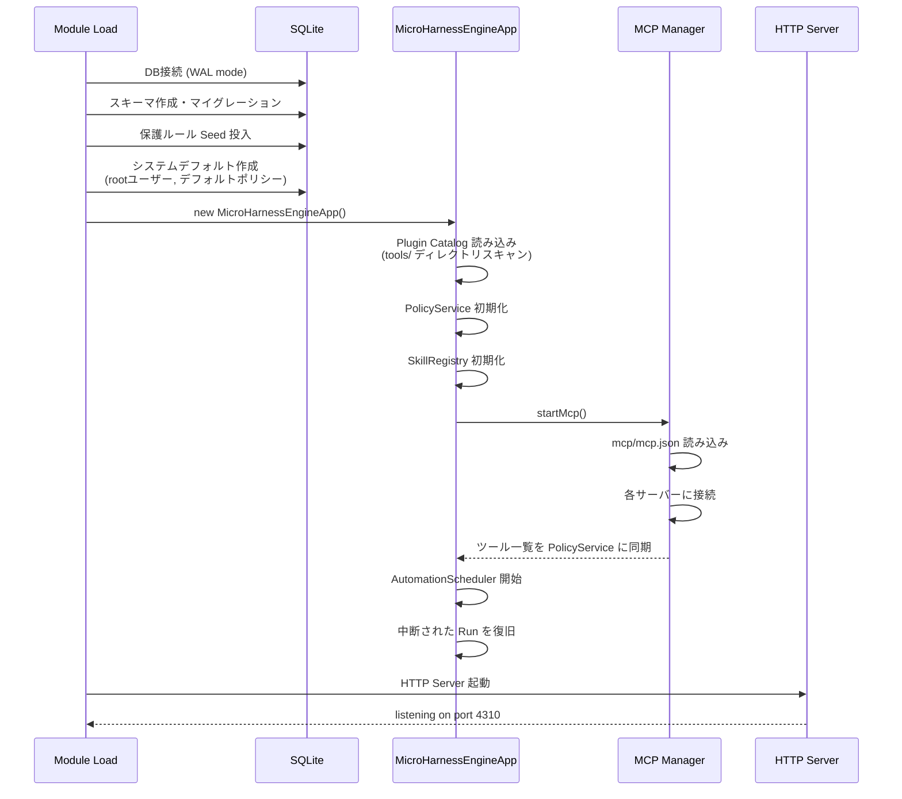

# Architecture

microHarnessEngineのシステム構成とデータフローの詳細です。

---

## 全体構成図

```mermaid
graph TB
    subgraph "外部チャネル"
        WEB["Web UI (/)"]
        SLACK[Slack Bot]
        DISCORD[Discord Bot]
        PAT[API Client / PAT]
    end

    subgraph "microHarnessEngine (単一Node.jsプロセス)"

        subgraph "HTTP Layer"
            HTTP[HTTP Server<br/>Node.js built-in http]
            STATIC[Static File Server<br/>admin-web/dist]
            CORS[CORS Middleware]
        end

        subgraph "Authentication"
            AUTH_SVC[AuthService<br/>DB-backed Sessions]
            ADMIN_AUTH[AdminAuthService<br/>In-Memory Sessions]
            CSRF[CSRF Protection]
        end

        subgraph "Core Engine"
            APP[MicroHarnessEngineApp<br/>アプリケーションエンジン]
            LOOP[Agent Loop<br/>LLM⇔Tool ループ]
            POLICY_SVC[PolicyService<br/>ポリシー管理・適用]
        end

        subgraph "Security"
            PROTECT_SVC[Protection Engine<br/>パス・コンテンツ保護]
            MATCHER[Path Matcher<br/>exact/dirname/glob]
            CLASSIFIER[Content Classifier<br/>APIキー・トークン検出]
        end

        subgraph "Tool System"
            CATALOG[Plugin Catalog<br/>動的読み込み]
            REGISTRY[Tool Registry<br/>実行ゲートウェイ]
            MCP_MGR[MCP Manager<br/>外部ツールサーバー]
        end

        subgraph "LLM Providers"
            PROVIDER[Provider Router]
            ANTHROPIC[Anthropic<br/>Claude API]
            OPENAI[OpenAI<br/>GPT API]
            GEMINI[Gemini<br/>Google API]
        end

        subgraph "Adapters"
            WEB_ADAPT[Web Adapter]
            SLACK_ADAPT[Slack Adapter]
            DISCORD_ADAPT[Discord Adapter]
        end

        subgraph "Services"
            AUTO_SVC[AutomationService<br/>定期実行]
            SKILL_REG[SkillRegistry<br/>カスタムスキル]
        end

        DB[(SQLite<br/>better-sqlite3<br/>WAL mode)]
    end

    WEB --> HTTP
    SLACK --> HTTP
    DISCORD --> HTTP
    PAT --> HTTP

    HTTP --> CORS --> AUTH_SVC
    HTTP --> CORS --> ADMIN_AUTH
    HTTP --> STATIC

    AUTH_SVC --> CSRF
    ADMIN_AUTH --> CSRF
    AUTH_SVC --> DB

    APP --> LOOP
    APP --> POLICY_SVC
    APP --> AUTO_SVC
    APP --> SKILL_REG
    APP --> MCP_MGR

    LOOP --> PROVIDER
    LOOP --> REGISTRY
    LOOP --> POLICY_SVC

    PROVIDER --> ANTHROPIC
    PROVIDER --> OPENAI
    PROVIDER --> GEMINI

    REGISTRY --> CATALOG
    REGISTRY --> POLICY_SVC
    REGISTRY --> PROTECT_SVC
    PROTECT_SVC --> MATCHER
    PROTECT_SVC --> CLASSIFIER

    MCP_MGR --> REGISTRY

    APP --> WEB_ADAPT
    APP --> SLACK_ADAPT
    APP --> DISCORD_ADAPT

    APP --> DB
    POLICY_SVC --> DB
    PROTECT_SVC --> DB
```



---

## コンポーネント詳細

### HTTP Server

フレームワークを使わず、Node.js 標準の `http` モジュールで構築されています。

```
リクエスト
  ├── /api/* → API Router
  │     ├── CORS ヘッダ適用
  │     ├── OPTIONS → 204 (preflight)
  │     ├── Actor 解決 (Bearer token / Session cookie)
  │     └── ルートディスパッチ
  └── その他 → Static File Server (SPA)
        └── admin-web/dist/index.html へフォールバック
```

ルーティングは `:param` 形式のパスパラメータをサポートするカスタムマッチャーを使用します。

### MicroHarnessEngineApp (アプリケーションエンジン)

システムの中心。以下を統括します:

- 会話の作成・取得
- メッセージの受信とエージェント実行の開始
- 承認ワークフロー
- 自動化タスクの管理
- チャネルアダプタへの応答配信
- MCP サーバー管理
- スキル管理

### 認証の分離

```
┌─────────────────────┬──────────────────────────┐
│   User Auth         │   Admin Auth             │
├─────────────────────┼──────────────────────────┤
│ DB-backed sessions  │ In-Memory sessions       │
│ Rolling expiry      │ 固定 expiry              │
│ Cookie + Bearer     │ Cookie のみ              │
│ CSRF (session時)    │ CSRF (常時)              │
│ PAT 発行可能        │ PAT なし                 │
│ 再起動で維持        │ 再起動で消失             │
└─────────────────────┴──────────────────────────┘
```

Admin認証がDBに保存されない設計は意図的です。管理者セッションの永続化は攻撃面を広げるため、揮発性を選択しています。

### Tool Registry (実行ゲートウェイ)

すべてのツール実行はTool Registryを経由します。

```
ツール実行リクエスト
  │
  ├── 1. PolicyService.assertToolAllowed()
  │     → ユーザーの Tool Policy をチェック
  │     → 許可されていなければ 403
  │
  ├── 2. tool.execute(input, context)
  │     └── 内部で resolveProjectPath() を呼び出し
  │           ├── PolicyService.resolveFileAccess()
  │           │   → File Policy をチェック
  │           └── Protection Engine
  │               → パス保護ルールをチェック
  │
  └── 3. ProtectionError → createProtectionResult()
        → LLMにユーザーへの手動操作案内を返す
```

### Plugin Catalog (動的プラグイン読み込み)

```
起動時:
  tools/ ディレクトリをスキャン
    └── 各サブディレクトリの index.js を動的 import
          └── plugin オブジェクトを検証
                ├── name: string (必須)
                ├── description: string
                └── tools: Array (必須)
                      └── 各 tool: { name, execute, ... }

ツール名の重複は起動時にエラーとして検出されます。
```

### LLM Provider

3つのプロバイダが共通のインターフェースを実装しています。

```
Provider Interface:
  ├── name: string
  ├── displayName: string
  ├── getModel(): string
  ├── capabilities: { toolCalling, parallelToolCalls, ... }
  └── generate({ messages, systemPrompt, toolDefinitions, maxTokens })
        → { assistantMessage, assistantText, stopReason }
```

内部メッセージ形式は正規化レイヤー (`common.js`) で統一されています:

```
正規化メッセージ形式:
  { role: 'user' | 'assistant' | 'tool',
    content: [
      { type: 'text', text: string }
      { type: 'tool_call', callId, name, input }
      { type: 'tool_result', callId, name, output }
    ]
  }
```

各プロバイダの `generate()` は:
1. 正規化メッセージ → プロバイダ固有形式に変換
2. API呼び出し
3. レスポンス → 正規化形式に変換

---

## 起動シーケンス



---

## シャットダウンシーケンス

`SIGTERM` / `SIGINT` を受信すると:

1. AutomationScheduler を停止
2. MCP Manager を停止（全サーバー切断）
3. HTTP Server をクローズ
4. 10秒後に強制終了（グレースフル停止が完了しない場合）

---

## ディレクトリ構造

```
src/
├── index.js                      # エントリポイント (startApiServer)
├── cli-root.js                   # CLI エントリポイント
├── http/
│   └── server.js                 # HTTPサーバー + 全APIルート定義
├── core/
│   ├── app.js                    # MicroHarnessEngineApp クラス
│   ├── config.js                 # 環境変数ベースの設定
│   ├── store.js                  # SQLite データアクセス層 (全テーブル定義)
│   ├── http.js                   # HttpError クラス
│   ├── security.js               # 暗号化・Cookie・署名検証
│   ├── authService.js            # ユーザー認証サービス
│   ├── adminAuthService.js       # 管理者認証サービス (in-memory)
│   ├── policyService.js          # ポリシー管理・実行時適用
│   ├── automationService.js      # 定期実行管理
│   ├── skillRegistry.js          # カスタムスキル管理 (Markdownファイル)
│   ├── systemDefaults.js         # システムデフォルト定数
│   ├── adapters/
│   │   ├── index.js              # アダプタ登録
│   │   ├── web.js                # Web (stub, SSE/WSで配信)
│   │   ├── slack.js              # Slack Events API + Block Kit
│   │   └── discord.js            # Discord Interactions
│   ├── tools/
│   │   ├── registry.js           # ツール実行ゲートウェイ
│   │   ├── catalog.js            # プラグイン動的読み込み
│   │   └── helpers.js            # パス解決・保護チェックヘルパー
│   └── cli/
│       └── rootCli.js            # CLIコマンド定義
├── protection/
│   ├── service.js                # Protection Engine 本体
│   ├── matcher.js                # パスマッチング (exact/dirname/glob)
│   ├── classifier.js             # 機密情報パターン検出・redaction
│   ├── defaultRules.js           # デフォルト保護ルール
│   ├── errors.js                 # ProtectionError 型
│   └── api.js                    # 保護ルール管理API
├── providers/
│   ├── index.js                  # プロバイダルーター
│   ├── common.js                 # メッセージ正規化・ユーティリティ
│   ├── anthropic.js              # Claude API (@anthropic-ai/sdk)
│   ├── openai.js                 # OpenAI API (fetch ベース)
│   └── gemini.js                 # Gemini API (fetch ベース)
├── mcp/
│   ├── index.js                  # McpManager (複数サーバー管理)
│   ├── client.js                 # McpClient (単一サーバー接続)
│   ├── transport.js              # StdioTransport / HttpTransport
│   ├── config.js                 # mcp.json 読み書き
│   └── protocol.js               # MCP プロトコルヘルパー
└── admin-web/                    # React + Vite 管理画面 SPA
```
