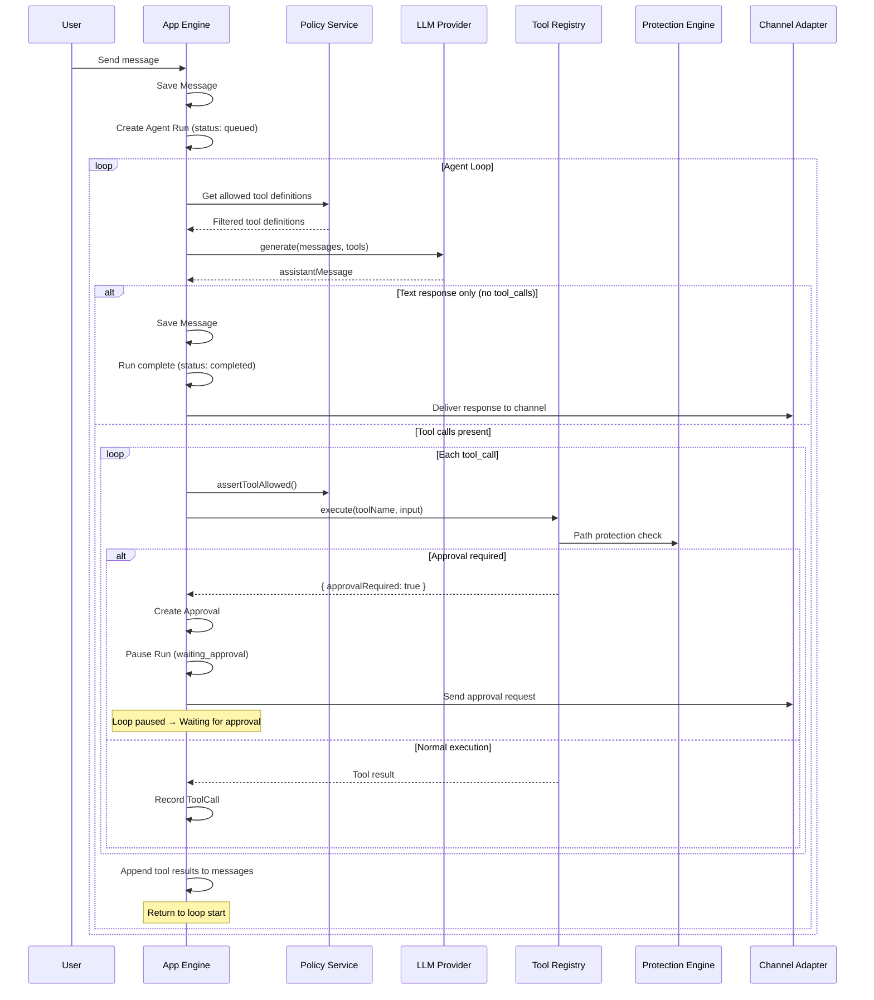
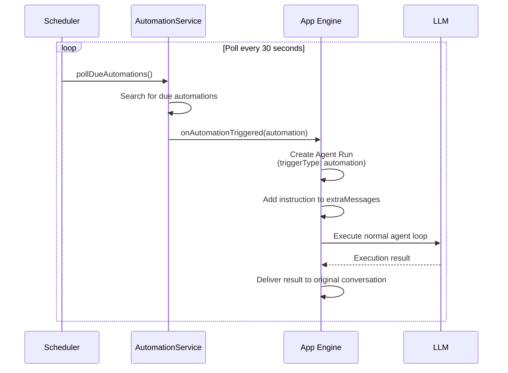

English | [日本語](../ja/agent-loop.md)

# Agent Loop

Details on how the agent loop works, approval workflows, automatic recovery, and scheduled execution.

---

## Loop Overview

This is the processing flow from the user's message to the assistant's final response.



---

## Run Lifecycle

```
queued → running → completed
                 → failed
                 → waiting_approval → (approve/deny) → running → ...
                 → recovering → running → ...
                                       → failed
```

### Statuses

| Status | Description |
|---|---|
| `queued` | Waiting for execution |
| `running` | Loop in progress |
| `waiting_approval` | Waiting for human approval |
| `recovering` | Automatic recovery from error in progress |
| `completed` | Completed successfully |
| `failed` | Terminated with error |

### Phases

Phases track more granular states within a Run:

| Phase | Description |
|---|---|
| `queued` | Entered the execution queue |
| `calling_model` | Calling the LLM API |
| `processing_response` | Processing the response |
| `tool_results` | Aggregating tool execution results |
| `waiting_approval` | Waiting for approval |
| `approval_resumed` | Loop resumed after approval |
| `recovering` | Recovery in progress |
| `completed` | Completed |
| `failed` | Failed |

---

## Message Construction

### New Conversation

```
1. Load all messages from DB
2. Convert to { role, content: [{ type: 'text', text }] } format
3. Perform provider-specific normalization
4. Append extraMessages if present (e.g., automation instructions)
```

### Continuation Loop

During the loop, `loopMessages` accumulate in memory:

```
[
  { role: 'user', content: [...] },           // Past messages
  { role: 'assistant', content: [...] },       // LLM response
  { role: 'tool', content: [tool_result] },    // Tool result
  { role: 'assistant', content: [...] },       // Next LLM response
  ...
]
```

These `loopMessages` are saved in the Run's `snapshot`, allowing resumption with full context after approval waits or recovery.

---

## Tool Execution Details

### Execution Flow

```
1. Tool Policy check
   PolicyService.assertToolAllowed(userId, toolName)
   → Tools not on the allow list return 403

2. Tool-specific preprocessing
   Example: delete_file checks approvalGranted

3. Path resolution + File Policy check
   resolveProjectPath(path, context)
   → PolicyService.resolveFileAccess(userId, path)
   → Verify path is within File Policy root scope

4. Protection Engine check
   assertPathActionAllowed(displayPath, action)
   → Check against protection rules

5. Actual file operation
   fs.readFileSync, fs.writeFileSync, etc.

6. Return result
   { ok: true, path, content, ... }
```

### Tool Call Recording

Each tool call is recorded in the `run_tool_calls` table:

```
┌──────────┬────────────┬───────────────────┬─────────┐
│ run_id   │ tool_name  │ input_json        │ status  │
├──────────┼────────────┼───────────────────┼─────────┤
│ run-001  │ read_file  │ {"path":"src/.."}│ success │
│ run-001  │ write_file │ {"path":"src/.."}│ success │
│ run-001  │ delete_file│ {"path":"tmp/.."}│ started │
└──────────┴────────────┴───────────────────┴─────────┘
```

Cache feature: If a tool call with the same `callId` is re-executed within the same Run (during recovery), the previous successful result is returned from the cache.

### Skill Execution

`use_skill` is a special tool that returns the prompt of a skill registered in the SkillRegistry.

```
LLM: use_skill({ skill_name: "code_review" })
→ { ok: true, skill: "code_review", instructions: "Review prompt..." }
→ The LLM acts according to these instructions
```

### MCP Tool Execution

If a tool name contains `__`, it is routed to the MCP Manager:

```
Tool name: github__search_repositories
  → serverName: github
  → toolName: search_repositories
  → McpClient.callTool("search_repositories", input)
  → Normalize and return result
```

---

## Approval Workflow

### Trigger

The approval flow is triggered when a tool returns `{ approvalRequired: true }`.

Current implementation:
- `delete_file` — Always requires approval when `context.approvalGranted` is false

### Approval Processing Flow

```
1. Save Approval record to DB
   - Conversation ID, Run ID, tool name, input parameters, reason
   - status: pending

2. Change Run to waiting_approval
   - Save pendingTool: { callId, name, input } in snapshot

3. Notify via channel adapter
   - Web: Real-time update
   - Slack: Block Kit buttons (Approve / Deny)
   - Discord: Component buttons (Approve / Deny)

4. Receive approval/denial
   - User: Chat screen or Slack/Discord buttons
   - Admin: Approvals section in admin panel

5. If approved:
   - Execute the tool (approvalGranted = true)
   - Append result to loopMessages
   - Set Run back to running, resume loop

6. If denied:
   - Append "Human approval was denied." as tool result
   - Set Run back to running, resume loop
   - The LLM can recognize the denial and suggest alternatives
```

---

## Automatic Recovery

### API Error Retries

Automatic retries are performed when transient errors occur during LLM API calls.

```
Retry targets:
  - HTTP 429 (Rate Limit)
  - HTTP 500, 502, 503, 504, 529 (Server Error)
  - ETIMEDOUT, ECONNRESET, UND_ERR_CONNECT_TIMEOUT
  - Messages containing "overloaded", "rate_limit", "capacity", etc.

Retry strategy:
  - Maximum 4 attempts
  - Exponential backoff: 500ms, 1000ms, 2000ms, 4000ms
```

### Run-Level Recovery

Even after retries are exhausted, recovery is attempted at the Run level.

```
Run state:
  running → recovering (retryable error)
  recovering → running (retry succeeded)
  recovering → failed (reached maximum of 3 attempts)
```

### Recovery After Server Restart

On server startup, `recoverInterruptedRuns()` is called to reprocess all Runs with `status: recovering`.

```
On startup:
  1. Retrieve all Runs in recovering state from DB
  2. Execute processRun() for each Run
  3. Restore loopMessages from snapshot
     → Fully inherits the context from before the interruption
```

---

## Conversation Events

Agent actions are recorded as events.

| Event Type | Description |
|---|---|
| `conversation.created` | Conversation was created |
| `message.user` | User message |
| `message.assistant` | Assistant response |
| `run.queued` | Run was queued |
| `run.started` | Run started |
| `run.recovering` | Run is recovering |
| `run.failed` | Run failed |
| `tool.result` | Tool execution result |
| `approval.requested` | Approval request |
| `approval.decided` | Approved/denied |
| `automation.created` | Automation was created |
| `automation.triggered` | Automation was triggered |

Events have auto-incrementing integer IDs and support cursor-based streaming.

---

## Automation (Scheduled Execution)

### How It Works

Automations are scheduled execution tasks that the LLM registers using tools within a chat.

```
User: "Check disk usage every morning at 9 AM"

LLM → create_automation({
  name: "daily-disk-check",
  instruction: "Check disk usage and report",
  interval_minutes: 1440
})
```

### Execution Flow



### Management

| Operation | User | Admin |
|---|---|---|
| Create | From chat (via tool) | - |
| List | Own automations | All automations |
| Pause | Own automations | Any automation |
| Resume | Own automations | - |
| Delete | Own automations | Any automation |
| Execute immediately | Own automations | - |

- Minimum interval: 5 minutes
- Default polling interval: 30 seconds (configurable via `AUTOMATION_TICK_MS`)
- Automations are owned by the user who created them and are associated with that conversation
