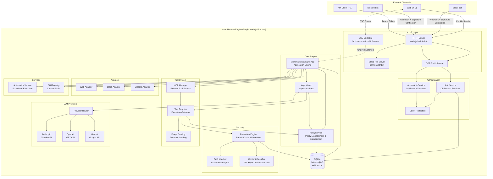
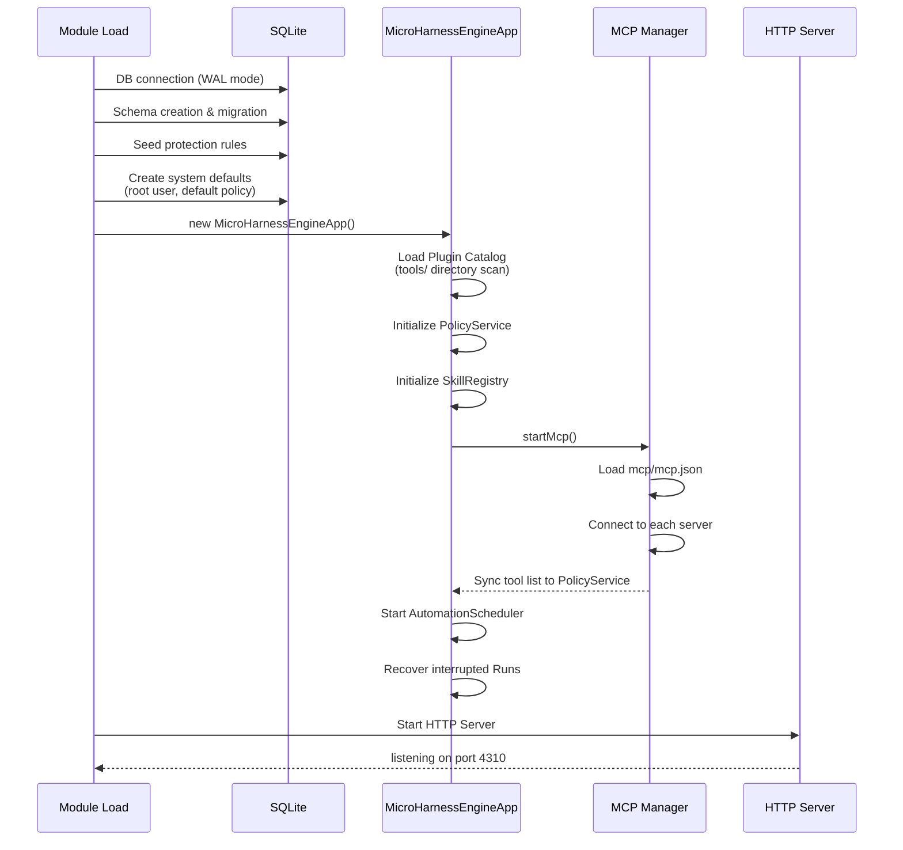

English | [日本語](../ja/architecture.md)

# Architecture

Details of the microHarnessEngine system configuration and data flow.

---

## Overall Architecture Diagram



---

## Component Details

### HTTP Server

Built using the standard Node.js `http` module without any framework.

```
Request
  |-- /api/* -> API Router
  |     |-- Apply CORS headers
  |     |-- OPTIONS -> 204 (preflight)
  |     |-- Actor resolution (Bearer token / Session cookie)
  |     |-- GET /api/conversations/:id/stream -> SSE streaming
  |     |-- POST /api/runs/:runId/cancel -> Cancel
  |     +-- Route dispatch
  +-- Other -> Static File Server (SPA)
        +-- Fallback to admin-web/dist/index.html
```

Routing uses a custom matcher that supports `:param` style path parameters.

### MicroHarnessEngineApp (Application Engine)

The center of the system. It coordinates the following:

- Creating and retrieving conversations
- Receiving messages and starting agent execution
- Approval workflows
- Automation task management
- Delivering responses to channel adapters
- MCP server management
- Skill management
- SSE event listener management
- Run cancel control

#### SSE Listener Management Methods

| Method | Description |
|---|---|
| `addRunEventListener(conversationId, listener)` | Register an SSE listener |
| `removeRunEventListener(conversationId, listener)` | Remove an SSE listener |
| `emitRunEvent(runId, event)` | Deliver event to all listeners |

#### Cancel Control Methods

| Method | Description |
|---|---|
| `cancelRun({ runId, actor })` | Cancel a Run, abort the AbortController |
| `isRunCancelled(runId)` | Check if a Run is cancelled |
| `getAbortSignal(runId)` | Get the AbortSignal for a Run |
| `finalizeCancelledRun(runId, loopMessages, conversation)` | Post-cancellation cleanup (partial text saving, etc.) |

### Authentication Separation

```
+---------------------+--------------------------+
|   User Auth         |   Admin Auth             |
+---------------------+--------------------------+
| DB-backed sessions  | In-Memory sessions       |
| Rolling expiry      | Fixed expiry             |
| Cookie + Bearer     | Cookie only              |
| CSRF (for sessions) | CSRF (always)            |
| PAT issuable        | No PAT                   |
| Persists on restart | Lost on restart          |
+---------------------+--------------------------+
```

The design of not persisting Admin authentication to the database is intentional. Persisting admin sessions would increase the attack surface, so volatility was chosen.

### Tool Registry (Execution Gateway)

All tool executions go through the Tool Registry.

```
Tool execution request
  |
  |-- 1. PolicyService.assertToolAllowed()
  |     -> Check user's Tool Policy
  |     -> 403 if not allowed
  |
  |-- 2. tool.execute(input, context)
  |     +-- Internally calls resolveProjectPath()
  |           |-- PolicyService.resolveFileAccess()
  |           |   -> Check File Policy
  |           +-- Protection Engine
  |               -> Check path protection rules
  |
  +-- 3. ProtectionError -> createProtectionResult()
        -> Return manual operation guidance to the LLM for the user
```

### Plugin Catalog (Dynamic Plugin Loading)

```
At startup:
  Scan tools/ directory
    +-- Dynamically import index.js from each subdirectory
          +-- Validate plugin object
                |-- name: string (required)
                |-- description: string
                +-- tools: Array (required)
                      +-- Each tool: { name, execute, ... }

Duplicate tool names are detected as errors at startup.
```

### LLM Provider

Three providers implement a common interface.

```
Provider Interface:
  |-- name: string
  |-- displayName: string
  |-- getModel(): string
  |-- capabilities: { toolCalling, parallelToolCalls, ... }
  +-- async *generate({ messages, systemPrompt, toolDefinitions, maxTokens, signal })
        |-- yield { type: 'text_delta', text }  (streaming)
        +-- return { assistantMessage, assistantText, stopReason }
```

`generate()` is implemented as an async generator, yielding text deltas during streaming and returning the normalized response upon completion. The `signal` parameter (`AbortSignal`) enables immediate interruption on cancellation.

Internal message format is unified through a normalization layer (`common.js`):

```
Normalized message format:
  { role: 'user' | 'assistant' | 'tool',
    content: [
      { type: 'text', text: string }
      { type: 'tool_call', callId, name, input }
      { type: 'tool_result', callId, name, output }
    ]
  }
```

Each provider's `generate()`:
1. Converts normalized messages to provider-specific format
2. Makes streaming API call (yielding text deltas)
3. Converts response to normalized format and returns

---

## SSE Streaming

### Communication Flow

```mermaid
sequenceDiagram
    participant Browser as Browser (lib/sse.js)
    participant Server as HTTP Server
    participant App as MicroHarnessEngineApp
    participant Loop as runLoop()

    Browser->>Server: GET /api/conversations/:id/stream
    Server->>Server: Set response headers<br/>(text/event-stream)
    Server-->>Browser: : connected

    Server->>App: addRunEventListener(conversationId, listener)

    loop Heartbeat (every 30 seconds)
        Server-->>Browser: : heartbeat
    end

    Loop->>App: emitRunEvent(runId, event)
    App->>Server: listener(event)
    Server-->>Browser: event: delta\ndata: {"type":"text_delta","text":"..."}

    Browser->>Browser: Close connection
    Server->>App: removeRunEventListener(conversationId, listener)
```

### Server-Side SSE Response

| Header | Value |
|---|---|
| `Content-Type` | `text/event-stream` |
| `Cache-Control` | `no-cache` |
| `Connection` | `keep-alive` |
| `X-Accel-Buffering` | `no` |

A `: connected\n\n` comment is sent on initial connection. A `: heartbeat\n\n` comment is sent every 30 seconds to keep the connection alive.

### Client-Side SSE (lib/sse.js)

A custom implementation using `fetch()` + `ReadableStream` rather than the `EventSource` API:

- `credentials: 'include'` for cookie authentication
- Response body is read chunk-by-chunk via `getReader()`
- Event boundaries split on `\n\n`, parsing `event:` and `data:` lines
- Comment lines starting with `:` (heartbeats) are ignored
- Returns `{ close() }`, which disconnects via `AbortController.abort()`

### Fallback Specification

When an SSE connection error occurs, it falls back to 4-second interval polling (`loadWorkspace()`). SSE reconnection is not performed automatically (until component remount).

---

## Startup Sequence



---

## Shutdown Sequence

Upon receiving `SIGTERM` / `SIGINT`:

1. Stop AutomationScheduler
2. Stop MCP Manager (disconnect all servers)
3. Close HTTP Server
4. Force terminate after 10 seconds (if graceful shutdown does not complete)

---

## Directory Structure

```
src/
|-- index.js                      # Entry point (startApiServer)
|-- cli-root.js                   # CLI entry point
|-- http/
|   +-- server.js                 # HTTP server + all API route definitions + SSE
|-- core/
|   |-- app.js                    # MicroHarnessEngineApp class
|   |-- config.js                 # Environment variable-based configuration
|   |-- store.js                  # SQLite data access layer (all table definitions)
|   |-- http.js                   # HttpError class
|   |-- security.js               # Encryption, cookies, signature verification
|   |-- authService.js            # User authentication service
|   |-- adminAuthService.js       # Admin authentication service (in-memory)
|   |-- policyService.js          # Policy management & runtime enforcement
|   |-- automationService.js      # Scheduled execution management
|   |-- skillRegistry.js          # Custom skill management (Markdown files)
|   |-- systemDefaults.js         # System default constants
|   |-- adapters/
|   |   |-- index.js              # Adapter registration
|   |   |-- web.js                # Web (stub, delivered via SSE)
|   |   |-- slack.js              # Slack Events API + Block Kit
|   |   +-- discord.js            # Discord Interactions
|   |-- tools/
|   |   |-- registry.js           # Tool execution gateway
|   |   |-- catalog.js            # Dynamic plugin loading
|   |   +-- helpers.js            # Path resolution & protection check helpers
|   +-- cli/
|       +-- rootCli.js            # CLI command definitions
|-- protection/
|   |-- service.js                # Protection Engine core
|   |-- matcher.js                # Path matching (exact/dirname/glob)
|   |-- classifier.js             # Sensitive information pattern detection & redaction
|   |-- defaultRules.js           # Default protection rules
|   |-- errors.js                 # ProtectionError type
|   +-- api.js                    # Protection rule management API
|-- providers/
|   |-- index.js                  # Provider router
|   |-- common.js                 # Message normalization & utilities
|   |-- anthropic.js              # Claude API (@anthropic-ai/sdk)
|   |-- openai.js                 # OpenAI API (fetch-based)
|   +-- gemini.js                 # Gemini API (fetch-based)
|-- mcp/
|   |-- index.js                  # McpManager (multi-server management)
|   |-- client.js                 # McpClient (single server connection)
|   |-- transport.js              # StdioTransport / HttpTransport
|   |-- config.js                 # mcp.json read/write
|   +-- protocol.js               # MCP protocol helpers
+-- admin-web/                    # React + Vite SPA
    +-- src/
        |-- lib/
        |   |-- api.js            # axios-based API client
        |   |-- axios.js          # axios instance + interceptors
        |   |-- sse.js            # SSE client (fetch + ReadableStream)
        |   |-- motion.js         # framer-motion presets
        |   |-- navigateRef.js    # navigate bridge for non-React code
        |   +-- utils.js          # cn() utility
        |-- stores/
        |   |-- workspace.js      # workspaceAtom, selectedConversationIdAtom, etc.
        |   |-- ui.js             # themeAtom, workspaceBusyKeyAtom, etc.
        |   |-- auth.js           # authStateAtom, adminAuthStateAtom
        |   +-- admin.js          # adminDataAtom
        |-- hooks/
        |   |-- useWorkspace.js   # SSE connection, polling, all workspace operations
        |   |-- useAuth.js        # User authentication
        |   |-- useAdmin.js       # Admin operations
        |   +-- useTheme.js       # Theme toggle
        +-- components/
            |-- chat/
            |   |-- MessageList.jsx      # Message list + StreamingBubble
            |   |-- MessageBubble.jsx    # Message display + ToolMessage
            |   |-- ChatInput.jsx        # Input form + Run status display
            |   +-- ConversationSidebar.jsx  # Conversation list sidebar
            +-- shared/
                +-- ProtectedRoute.jsx   # Auth guard
```
