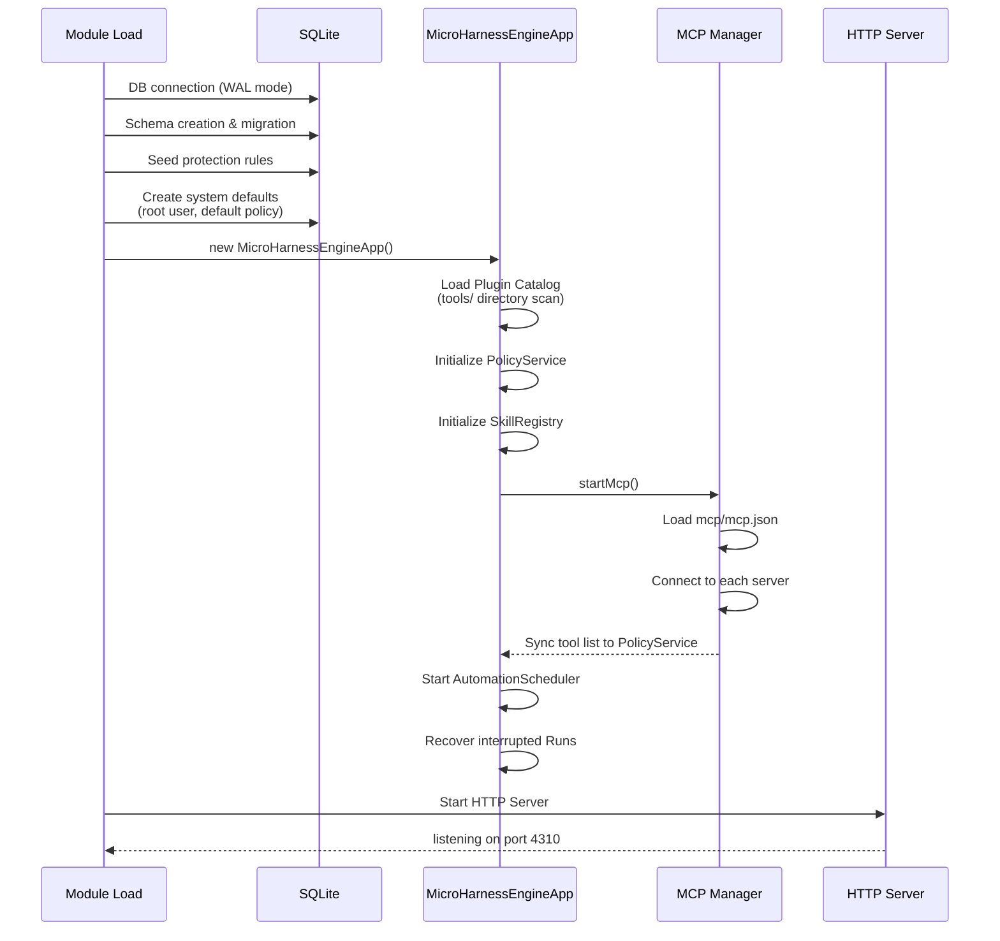

English | [日本語](../ja/architecture.md)

# Architecture

Details of the microHarnessEngine system configuration and data flow.

---

## Overall Architecture Diagram

```mermaid
graph TB
    subgraph "External Channels"
        WEB["Web UI (/)"]
        SLACK[Slack Bot]
        DISCORD[Discord Bot]
        PAT[API Client / PAT]
    end

    subgraph "microHarnessEngine (Single Node.js Process)"

        subgraph "HTTP Layer"
            HTTP[HTTP Server<br/>Node.js built-in http]
            STATIC[Static File Server<br/>admin-web/dist]
            CORS[CORS Middleware]
        end

        subgraph "Authentication"
            AUTH_SVC[AuthService<br/>DB-backed Sessions]
            ADMIN_AUTH[AdminAuthService<br/>In-Memory Sessions]
            CSRF[CSRF Protection]
        end

        subgraph "Core Engine"
            APP[MicroHarnessEngineApp<br/>Application Engine]
            LOOP[Agent Loop<br/>LLM⇔Tool Loop]
            POLICY_SVC[PolicyService<br/>Policy Management & Enforcement]
        end

        subgraph "Security"
            PROTECT_SVC[Protection Engine<br/>Path & Content Protection]
            MATCHER[Path Matcher<br/>exact/dirname/glob]
            CLASSIFIER[Content Classifier<br/>API Key & Token Detection]
        end

        subgraph "Tool System"
            CATALOG[Plugin Catalog<br/>Dynamic Loading]
            REGISTRY[Tool Registry<br/>Execution Gateway]
            MCP_MGR[MCP Manager<br/>External Tool Servers]
        end

        subgraph "LLM Providers"
            PROVIDER[Provider Router]
            ANTHROPIC[Anthropic<br/>Claude API]
            OPENAI[OpenAI<br/>GPT API]
            GEMINI[Gemini<br/>Google API]
        end

        subgraph "Adapters"
            WEB_ADAPT[Web Adapter]
            SLACK_ADAPT[Slack Adapter]
            DISCORD_ADAPT[Discord Adapter]
        end

        subgraph "Services"
            AUTO_SVC[AutomationService<br/>Scheduled Execution]
            SKILL_REG[SkillRegistry<br/>Custom Skills]
        end

        DB[(SQLite<br/>better-sqlite3<br/>WAL mode)]
    end

    WEB --> HTTP
    SLACK --> HTTP
    DISCORD --> HTTP
    PAT --> HTTP

    HTTP --> CORS --> AUTH_SVC
    HTTP --> CORS --> ADMIN_AUTH
    HTTP --> STATIC

    AUTH_SVC --> CSRF
    ADMIN_AUTH --> CSRF
    AUTH_SVC --> DB

    APP --> LOOP
    APP --> POLICY_SVC
    APP --> AUTO_SVC
    APP --> SKILL_REG
    APP --> MCP_MGR

    LOOP --> PROVIDER
    LOOP --> REGISTRY
    LOOP --> POLICY_SVC

    PROVIDER --> ANTHROPIC
    PROVIDER --> OPENAI
    PROVIDER --> GEMINI

    REGISTRY --> CATALOG
    REGISTRY --> POLICY_SVC
    REGISTRY --> PROTECT_SVC
    PROTECT_SVC --> MATCHER
    PROTECT_SVC --> CLASSIFIER

    MCP_MGR --> REGISTRY

    APP --> WEB_ADAPT
    APP --> SLACK_ADAPT
    APP --> DISCORD_ADAPT

    APP --> DB
    POLICY_SVC --> DB
    PROTECT_SVC --> DB
```



---

## Component Details

### HTTP Server

Built using the standard Node.js `http` module without any framework.

```
Request
  |-- /api/* -> API Router
  |     |-- Apply CORS headers
  |     |-- OPTIONS -> 204 (preflight)
  |     |-- Actor resolution (Bearer token / Session cookie)
  |     +-- Route dispatch
  +-- Other -> Static File Server (SPA)
        +-- Fallback to admin-web/dist/index.html
```

Routing uses a custom matcher that supports `:param` style path parameters.

### MicroHarnessEngineApp (Application Engine)

The center of the system. It coordinates the following:

- Creating and retrieving conversations
- Receiving messages and starting agent execution
- Approval workflows
- Automation task management
- Delivering responses to channel adapters
- MCP server management
- Skill management

### Authentication Separation

```
+---------------------+--------------------------+
|   User Auth         |   Admin Auth             |
+---------------------+--------------------------+
| DB-backed sessions  | In-Memory sessions       |
| Rolling expiry      | Fixed expiry             |
| Cookie + Bearer     | Cookie only              |
| CSRF (for sessions) | CSRF (always)            |
| PAT issuable        | No PAT                   |
| Persists on restart | Lost on restart          |
+---------------------+--------------------------+
```

The design of not persisting Admin authentication to the database is intentional. Persisting admin sessions would increase the attack surface, so volatility was chosen.

### Tool Registry (Execution Gateway)

All tool executions go through the Tool Registry.

```
Tool execution request
  |
  |-- 1. PolicyService.assertToolAllowed()
  |     -> Check user's Tool Policy
  |     -> 403 if not allowed
  |
  |-- 2. tool.execute(input, context)
  |     +-- Internally calls resolveProjectPath()
  |           |-- PolicyService.resolveFileAccess()
  |           |   -> Check File Policy
  |           +-- Protection Engine
  |               -> Check path protection rules
  |
  +-- 3. ProtectionError -> createProtectionResult()
        -> Return manual operation guidance to the LLM for the user
```

### Plugin Catalog (Dynamic Plugin Loading)

```
At startup:
  Scan tools/ directory
    +-- Dynamically import index.js from each subdirectory
          +-- Validate plugin object
                |-- name: string (required)
                |-- description: string
                +-- tools: Array (required)
                      +-- Each tool: { name, execute, ... }

Duplicate tool names are detected as errors at startup.
```

### LLM Provider

Three providers implement a common interface.

```
Provider Interface:
  |-- name: string
  |-- displayName: string
  |-- getModel(): string
  |-- capabilities: { toolCalling, parallelToolCalls, ... }
  +-- generate({ messages, systemPrompt, toolDefinitions, maxTokens })
        -> { assistantMessage, assistantText, stopReason }
```

Internal message format is unified through a normalization layer (`common.js`):

```
Normalized message format:
  { role: 'user' | 'assistant' | 'tool',
    content: [
      { type: 'text', text: string }
      { type: 'tool_call', callId, name, input }
      { type: 'tool_result', callId, name, output }
    ]
  }
```

Each provider's `generate()`:
1. Converts normalized messages to provider-specific format
2. Makes API call
3. Converts response to normalized format

---

## Startup Sequence



---

## Shutdown Sequence

Upon receiving `SIGTERM` / `SIGINT`:

1. Stop AutomationScheduler
2. Stop MCP Manager (disconnect all servers)
3. Close HTTP Server
4. Force terminate after 10 seconds (if graceful shutdown does not complete)

---

## Directory Structure

```
src/
|-- index.js                      # Entry point (startApiServer)
|-- cli-root.js                   # CLI entry point
|-- http/
|   +-- server.js                 # HTTP server + all API route definitions
|-- core/
|   |-- app.js                    # MicroHarnessEngineApp class
|   |-- config.js                 # Environment variable-based configuration
|   |-- store.js                  # SQLite data access layer (all table definitions)
|   |-- http.js                   # HttpError class
|   |-- security.js               # Encryption, cookies, signature verification
|   |-- authService.js            # User authentication service
|   |-- adminAuthService.js       # Admin authentication service (in-memory)
|   |-- policyService.js          # Policy management & runtime enforcement
|   |-- automationService.js      # Scheduled execution management
|   |-- skillRegistry.js          # Custom skill management (Markdown files)
|   |-- systemDefaults.js         # System default constants
|   |-- adapters/
|   |   |-- index.js              # Adapter registration
|   |   |-- web.js                # Web (stub, delivered via SSE/WS)
|   |   |-- slack.js              # Slack Events API + Block Kit
|   |   +-- discord.js            # Discord Interactions
|   |-- tools/
|   |   |-- registry.js           # Tool execution gateway
|   |   |-- catalog.js            # Dynamic plugin loading
|   |   +-- helpers.js            # Path resolution & protection check helpers
|   +-- cli/
|       +-- rootCli.js            # CLI command definitions
|-- protection/
|   |-- service.js                # Protection Engine core
|   |-- matcher.js                # Path matching (exact/dirname/glob)
|   |-- classifier.js             # Sensitive information pattern detection & redaction
|   |-- defaultRules.js           # Default protection rules
|   |-- errors.js                 # ProtectionError type
|   +-- api.js                    # Protection rule management API
|-- providers/
|   |-- index.js                  # Provider router
|   |-- common.js                 # Message normalization & utilities
|   |-- anthropic.js              # Claude API (@anthropic-ai/sdk)
|   |-- openai.js                 # OpenAI API (fetch-based)
|   +-- gemini.js                 # Gemini API (fetch-based)
|-- mcp/
|   |-- index.js                  # McpManager (multi-server management)
|   |-- client.js                 # McpClient (single server connection)
|   |-- transport.js              # StdioTransport / HttpTransport
|   |-- config.js                 # mcp.json read/write
|   +-- protocol.js               # MCP protocol helpers
+-- admin-web/                    # React + Vite admin panel SPA
```
