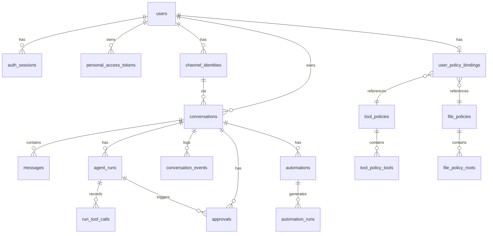

English | [日本語](../ja/data-model.md)

# Data Model

Details of the SQLite database schema and relations.

---

## ER Diagram

---

## Table Details

### users

User accounts.

| Column | Type | Constraints | Description |
|---|---|---|---|
| `id` | TEXT | PK | UUID |
| `login_name` | TEXT | UNIQUE | Login name (lowercase) |
| `email` | TEXT | UNIQUE | Email (legacy, unused) |
| `display_name` | TEXT | NOT NULL | Display name |
| `password_hash` | TEXT | | scrypt hash |
| `password_salt` | TEXT | | Salt |
| `role` | TEXT | NOT NULL, DEFAULT 'user' | `user` / `admin` |
| `status` | TEXT | NOT NULL, DEFAULT 'active' | `active` / `inactive` |
| `auth_source` | TEXT | NOT NULL, DEFAULT 'local' | `local` / `system` / `slack` / `discord` |
| `system_user_type` | TEXT | UNIQUE | `root` (special user identifier) |
| `created_at` | TEXT | NOT NULL | Created at |
| `updated_at` | TEXT | NOT NULL | Updated at |
| `last_login_at` | TEXT | | Last login at |

### auth_sessions

User sessions (persisted in DB).

| Column | Type | Constraints | Description |
|---|---|---|---|
| `id` | TEXT | PK | Session ID |
| `user_id` | TEXT | FK -> users | User ID |
| `csrf_token` | TEXT | NOT NULL | CSRF token |
| `expires_at` | TEXT | NOT NULL | Expiration time |
| `created_at` | TEXT | NOT NULL | Created at |
| `last_seen_at` | TEXT | NOT NULL | Last accessed at |
| `user_agent` | TEXT | | Browser information |
| `ip_hash` | TEXT | | SHA-256 of IP address |

### personal_access_tokens

API access tokens.

| Column | Type | Constraints | Description |
|---|---|---|---|
| `id` | TEXT | PK | UUID |
| `user_id` | TEXT | FK -> users | Owner |
| `name` | TEXT | NOT NULL | Token name |
| `token_hash` | TEXT | UNIQUE, NOT NULL | SHA-256 hash (raw token is not stored) |
| `created_at` | TEXT | NOT NULL | Issued at |
| `last_used_at` | TEXT | | Last used at |
| `revoked_at` | TEXT | | Revoked at |

### channel_identities

Identities for channel integrations.

| Column | Type | Constraints | Description |
|---|---|---|---|
| `id` | TEXT | PK | UUID |
| `user_id` | TEXT | FK -> users | User ID |
| `type` | TEXT | NOT NULL | `web` / `slack` / `discord` |
| `identity_key` | TEXT | UNIQUE, NOT NULL | `web:{userId}`, `slack:{team}:{user}:{channel}`, etc. |
| `display_label` | TEXT | NOT NULL | Display label |
| `status` | TEXT | NOT NULL | `active` |
| `metadata_json` | TEXT | | Channel-specific metadata (JSON) |

### conversations

Conversations.

| Column | Type | Constraints | Description |
|---|---|---|---|
| `id` | TEXT | PK | UUID |
| `user_id` | TEXT | FK -> users | Owner |
| `channel_identity_id` | TEXT | FK -> channel_identities | Channel |
| `title` | TEXT | NOT NULL | Conversation title |
| `status` | TEXT | NOT NULL | `active` |
| `source` | TEXT | NOT NULL | `web` / `slack` / `discord` |
| `external_ref` | TEXT | | Slack thread ts, Discord session, etc. |
| `last_message_at` | TEXT | | Last message at |

UNIQUE constraint: `(channel_identity_id, external_ref)`

### messages

Messages.

| Column | Type | Constraints | Description |
|---|---|---|---|
| `id` | TEXT | PK | UUID |
| `conversation_id` | TEXT | FK -> conversations | Conversation ID |
| `role` | TEXT | NOT NULL | `user` / `assistant` / `tool` |
| `author_user_id` | TEXT | FK -> users | Sender (nullable) |
| `content_text` | TEXT | NOT NULL | Text content |
| `content_json` | TEXT | | Structured content (JSON) |
| `created_at` | TEXT | NOT NULL | Sent at |

### agent_runs

Agent runs.

| Column | Type | Constraints | Description |
|---|---|---|---|
| `id` | TEXT | PK | UUID |
| `conversation_id` | TEXT | FK -> conversations | Conversation ID |
| `status` | TEXT | NOT NULL | `queued`/`running`/`waiting_approval`/`recovering`/`completed`/`failed` |
| `trigger_type` | TEXT | NOT NULL | `user_message`/`external_message`/`automation` |
| `trigger_message_id` | TEXT | | Trigger message ID |
| `automation_id` | TEXT | | Trigger Automation ID |
| `provider_name` | TEXT | NOT NULL | LLM provider name |
| `phase` | TEXT | NOT NULL | Detailed phase |
| `snapshot_json` | TEXT | | Snapshot of loop state (JSON) |
| `last_error` | TEXT | | Last error |
| `completed_at` | TEXT | | Completed at |

`snapshot_json` stores the entire loop messages, enabling context restoration during recovery.

### run_tool_calls

Records of tool calls.

| Column | Type | Constraints | Description |
|---|---|---|---|
| `id` | INTEGER | PK AUTOINCREMENT | |
| `run_id` | TEXT | NOT NULL | Run ID |
| `tool_use_id` | TEXT | NOT NULL | LLM tool_call ID |
| `tool_name` | TEXT | NOT NULL | Tool name |
| `input_json` | TEXT | | Input parameters (JSON) |
| `output_json` | TEXT | | Output result (JSON) |
| `status` | TEXT | NOT NULL | `started`/`success`/`error` |
| `error_text` | TEXT | | Error message |

UNIQUE constraint: `(run_id, tool_use_id)` -- Used as cache during recovery

### conversation_events

Conversation event stream.

| Column | Type | Constraints | Description |
|---|---|---|---|
| `id` | INTEGER | PK AUTOINCREMENT | Sequential number for cursor |
| `event_id` | TEXT | UNIQUE, NOT NULL | UUID |
| `conversation_id` | TEXT | FK -> conversations | Conversation ID |
| `run_id` | TEXT | | Run ID |
| `kind` | TEXT | NOT NULL | Event type |
| `payload_json` | TEXT | NOT NULL | Event data (JSON) |
| `created_at` | TEXT | NOT NULL | Occurred at |

### approvals

Approval requests.

| Column | Type | Constraints | Description |
|---|---|---|---|
| `id` | TEXT | PK | UUID |
| `conversation_id` | TEXT | FK -> conversations | Conversation ID |
| `run_id` | TEXT | FK -> agent_runs | Run ID |
| `requester_user_id` | TEXT | FK -> users | Requester |
| `channel_identity_id` | TEXT | FK -> channel_identities | Channel |
| `tool_name` | TEXT | NOT NULL | Tool name |
| `tool_input_json` | TEXT | NOT NULL | Tool input (JSON) |
| `reason` | TEXT | NOT NULL | Approval reason |
| `status` | TEXT | NOT NULL | `pending`/`approved`/`denied` |
| `requested_at` | TEXT | NOT NULL | Requested at |
| `expires_at` | TEXT | | Expiration |
| `decided_at` | TEXT | | Decided at |
| `decided_by_user_id` | TEXT | | Decided by (NULL for admin) |
| `decision_note` | TEXT | | Decision note |

### automations

Scheduled tasks.

| Column | Type | Constraints | Description |
|---|---|---|---|
| `id` | TEXT | PK | UUID |
| `owner_user_id` | TEXT | FK -> users | Owner |
| `channel_identity_id` | TEXT | FK -> channel_identities | Channel |
| `conversation_id` | TEXT | FK -> conversations | Conversation ID |
| `name` | TEXT | NOT NULL | Task name |
| `instruction` | TEXT | NOT NULL | Execution content |
| `schedule_kind` | TEXT | NOT NULL | `interval` |
| `interval_minutes` | INTEGER | NOT NULL | Execution interval (minutes, minimum 5) |
| `status` | TEXT | NOT NULL | `active`/`paused`/`deleted` |
| `next_run_at` | TEXT | NOT NULL | Next run at |
| `last_run_at` | TEXT | | Last run at |

### automation_runs

Records of Automation runs.

| Column | Type | Constraints | Description |
|---|---|---|---|
| `id` | TEXT | PK | UUID |
| `automation_id` | TEXT | FK -> automations | Automation ID |
| `conversation_id` | TEXT | FK -> conversations | Conversation ID |
| `run_id` | TEXT | | Agent Run ID |
| `status` | TEXT | NOT NULL | `started`/`queued`/`failed` |
| `error_text` | TEXT | | Error message |

---

## Policy-Related Tables

### tool_policies

| Column | Type | Constraints | Description |
|---|---|---|---|
| `id` | TEXT | PK | UUID |
| `name` | TEXT | UNIQUE, NOT NULL | Policy name |
| `description` | TEXT | | Description |
| `is_system` | INTEGER | NOT NULL, DEFAULT 0 | System policy flag |

### tool_policy_tools

| Column | Type | Constraints | Description |
|---|---|---|---|
| `policy_id` | TEXT | PK, FK -> tool_policies | Policy ID |
| `tool_name` | TEXT | PK | Allowed tool name |

### file_policies

| Column | Type | Constraints | Description |
|---|---|---|---|
| `id` | TEXT | PK | UUID |
| `name` | TEXT | UNIQUE, NOT NULL | Policy name |
| `description` | TEXT | | Description |
| `is_system` | INTEGER | NOT NULL, DEFAULT 0 | System policy flag |

### file_policy_roots

| Column | Type | Constraints | Description |
|---|---|---|---|
| `id` | TEXT | PK | UUID |
| `policy_id` | TEXT | FK -> file_policies | Policy ID |
| `scope` | TEXT | NOT NULL | `workspace` / `absolute` |
| `root_path` | TEXT | NOT NULL | Allowed path |
| `path_type` | TEXT | NOT NULL | `dir` / `file` |

UNIQUE constraint: `(policy_id, scope, root_path, path_type)`

### user_policy_bindings

| Column | Type | Constraints | Description |
|---|---|---|---|
| `user_id` | TEXT | PK, FK -> users | User ID |
| `tool_policy_id` | TEXT | FK -> tool_policies | Tool Policy |
| `file_policy_id` | TEXT | FK -> file_policies | File Policy |

---

## Protection-Related Tables

### protection_rules

| Column | Type | Constraints | Description |
|---|---|---|---|
| `id` | TEXT | PK | UUID |
| `pattern` | TEXT | NOT NULL | Matching pattern |
| `pattern_type` | TEXT | NOT NULL | `exact` / `dirname` / `glob` |
| `effect` | TEXT | NOT NULL, DEFAULT 'deny' | `deny` / `ask` / `allow` |
| `priority` | INTEGER | NOT NULL, DEFAULT 100 | Priority (lower value = higher priority) |
| `enabled` | INTEGER | NOT NULL, DEFAULT 1 | Enabled flag |
| `scope` | TEXT | NOT NULL, DEFAULT 'workspace' | `system` / `workspace` |
| `note` | TEXT | | Description |

UNIQUE constraint: `(pattern, pattern_type, scope)`

### protection_audit_logs

| Column | Type | Constraints | Description |
|---|---|---|---|
| `id` | TEXT | PK | UUID |
| `session_token` | TEXT | | Session token |
| `action` | TEXT | NOT NULL | `discover`/`read`/`write`/`move`/`delete` |
| `target_path` | TEXT | | Target path |
| `sink` | TEXT | | Destination |
| `decision` | TEXT | NOT NULL | `allow`/`deny`/`ask` |
| `matched_rule_id` | TEXT | | Matched rule ID |
| `reason` | TEXT | | Reason |

---

## Initial Data

Data automatically created on server startup:

| Data | Description |
|---|---|
| `root` user | System administrator (cannot be deleted or deactivated) |
| Default Tool Policy | Deny all tools (`is_system: 1`) |
| System All Tools Policy | Allow all tools (`is_system: 1`, auto-synced) |
| Default File Policy | Workspace only (`is_system: 1`, root: `.`) |
| Default protection rules | `.env`, `security/`, `secrets/`, etc. (6 rules) |
| root Policy Binding | System All Tools + Default File Policy |
