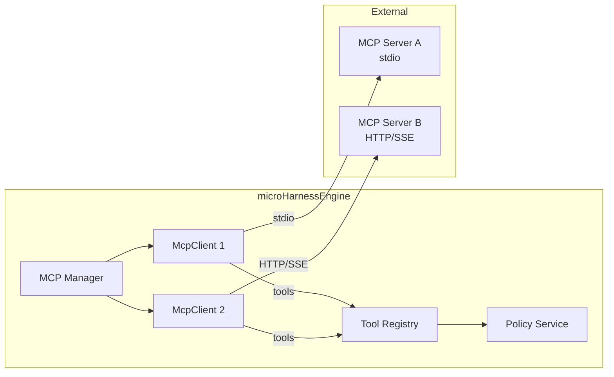
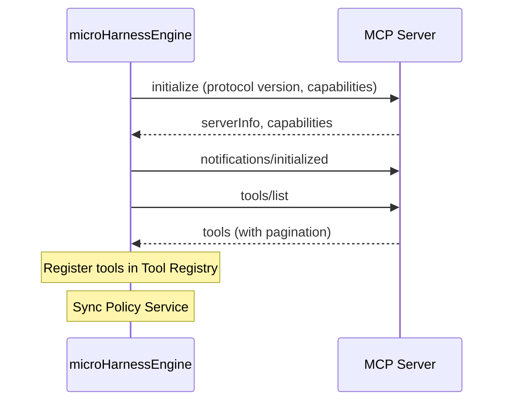

English | [日本語](../ja/mcp-guide.md)

# MCP Integration

How to integrate with Model Context Protocol (MCP) servers.

---

## Overview

microHarnessEngine has a built-in MCP client that can connect to external MCP servers and integrate them as tools.



MCP server tools are also subject to Tool Policy management. Users cannot use MCP tools unless an administrator explicitly grants permission.

---

## Configuration File

MCP server settings are stored in `mcp/mcp.json`. The format is compatible with Claude Desktop.

```json
{
  "mcpServers": {
    "github": {
      "command": "npx",
      "args": ["-y", "@modelcontextprotocol/server-github"],
      "env": {
        "GITHUB_TOKEN": "ghp_xxxx"
      }
    },
    "remote-api": {
      "url": "https://mcp.example.com/sse",
      "headers": {
        "Authorization": "Bearer token123"
      }
    }
  }
}
```

> `mcp/mcp.json` is protected by the default protection rules (because it contains API keys).

---

## Transports

### stdio Transport

Launches the MCP server as a child process and communicates via stdin/stdout.

```json
{
  "command": "npx",
  "args": ["-y", "@modelcontextprotocol/server-github"],
  "env": {
    "GITHUB_TOKEN": "ghp_xxxx"
  }
}
```

| Setting | Description |
|---|---|
| `command` | Command to execute |
| `args` | Array of command arguments |
| `env` | Environment variables (merged into `process.env`) |

- On Windows, launched with `shell: true`
- Process termination is automatically detected
- On server shutdown: SIGTERM, then SIGKILL after 5 seconds

### HTTP Transport (Streamable HTTP + SSE)

Communicates with the MCP server over HTTP.

```json
{
  "url": "https://mcp.example.com/sse",
  "headers": {
    "Authorization": "Bearer token123"
  }
}
```

| Setting | Description |
|---|---|
| `url` | MCP server URL |
| `headers` | Request headers |

- Session ID management (`Mcp-Session-Id` header)
- Automatic SSE stream connection
- SSE in POST responses is also supported

---

## Connection Flow



### Reconnection

Automatic reconnection is attempted on connection errors:

- Up to 3 attempts
- Exponential backoff: 2s, 4s, 6s
- If all attempts fail, `state: failed`

### Tool Change Notifications

When an MCP server sends `notifications/tools/list_changed`, the tool list is automatically re-fetched.

---

## Tool Namespacing

MCP tools are registered in the format `serverName__toolName`.

```
github__search_repositories
github__create_issue
slack__post_message
```

This namespacing ensures:
- Tool names do not collide across multiple MCP servers
- Each tool can be individually allowed/denied via Tool Policy
- The LLM can identify which server a tool belongs to

---

## Tool Result Normalization

Responses from MCP servers are normalized to microHarnessEngine's internal format:

| MCP Response | Conversion Result |
|---|---|
| `isError: true` | `{ ok: false, error: "..." }` |
| Single text content | Attempts JSON parsing, `{ ok: true, result: ... }` |
| Multiple text contents | Joined with newlines, `{ ok: true, result: "..." }` |
| Non-text (images, etc.) | `{ ok: true, result: { type, mimeType } }` |

---

## Admin Panel Operations

In the admin panel, the **MCP Servers** section provides the following operations:

| Operation | Description |
|---|---|
| **List** | Connection status, tool count, and last error for all servers |
| **Add** | Add a new MCP server |
| **Edit** | Modify server settings (triggers reconnection) |
| **Delete** | Disconnect and remove server configuration |
| **Reconnect** | Reconnect to a disconnected server |

Sensitive information (`env`, `headers`) is masked as `***` in the admin panel.

### Notes on Adding Servers

- Server name: `[a-zA-Z0-9_-]`, up to 64 characters
- Configuration requires either `command` or `url`
- After adding a server, its tools must be added to a Tool Policy before they can be used

---

## API

| Method | Path | Description |
|---|---|---|
| `GET` | `/api/admin/mcp-servers` | List servers |
| `POST` | `/api/admin/mcp-servers` | Add server |
| `PATCH` | `/api/admin/mcp-servers/:name` | Update settings |
| `DELETE` | `/api/admin/mcp-servers/:name` | Delete |
| `POST` | `/api/admin/mcp-servers/:name/reconnect` | Reconnect |

---

## Integration with Policy

When an MCP server connects or disconnects, `PolicyService.syncSystemPolicies()` is called and the **System All Tools** policy is automatically updated.

This means:
- The `root` user (assigned System All Tools) can use new MCP tools immediately
- Other users cannot use them until an administrator adds them to a Tool Policy (Default Deny)
