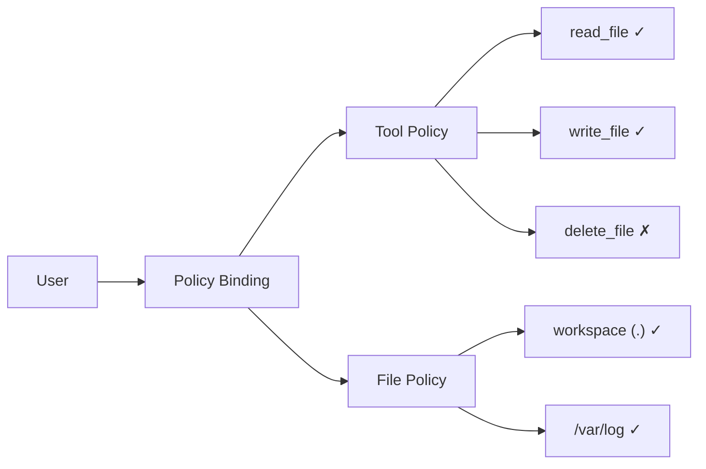

English | [日本語](../ja/policy-guide.md)

# Policy Guide

How the policy system in microHarnessEngine works and how to configure it.

---

## Overview

microHarnessEngine uses two types of policies for access control:

| Policy | Controls | Method |
|---|---|---|
| **Tool Policy** | Tools available to a user | Whitelist |
| **File Policy** | Paths a user can access | Root path specification |

Each user is assigned **one Tool Policy** and **one File Policy**.



---

## Tool Policy

### How It Works

A Tool Policy is a whitelist of tools that a user is allowed to use.

- Tools included in the list → allowed
- Tools not included in the list → denied (403)

**The tool definitions sent to the LLM are filtered.** Tools that are not permitted are not disclosed to the LLM.

```
During tool execution:
  1. Before sending to LLM: Include only permitted tools in tool definitions
  2. At execution time: Re-check with assertToolAllowed() (defense in depth)
```

### System Policies

Two system policies exist by default:

| Policy Name | Description | Editable | Deletable |
|---|---|---|---|
| **Default (deny all)** | Permits no tools at all | No | No |
| **System All Tools** | Automatically permits all registered tools | No | No |

- New users are assigned the **Default** policy
- The `root` user is assigned the **System All Tools** policy
- **System All Tools** is automatically updated when tools are added or MCP servers are connected

### Creating Custom Policies

Navigate to the admin panel → **Tool Policies** → click "Create".

```
Name: developer-readonly
Description: Read-only tools only

Permitted tools:
  ☑ list_files
  ☑ read_file
  ☑ glob
  ☑ grep
  ☐ write_file
  ☐ edit_file
  ☐ delete_file
  ...
```

### Tool Selection Guidelines

**Safe (read-only)**:
- `list_files` — List files
- `read_file` — Read files
- `glob` — Pattern search
- `grep` — Content search
- `git_info` — Git repository information

**Moderate (write)**:
- `write_file` — Create/overwrite files
- `edit_file` — Diff-based editing
- `multi_edit_file` — Batch editing of multiple locations
- `make_dir` — Create directories
- `move_file` — Move/rename
- `git_commit` — Create commits

**High risk (destructive/external communication)**:
- `delete_file` — Delete files (approval required)
- `git_push` — Push to remote
- `git_dangerous` — Destructive Git commands (approval required)
- `web_fetch` — Fetch external URLs
- `web_search` — Web search

**Automation**:
- `create_automation` — Create scheduled tasks
- `list_automations` — List tasks
- `pause_automation` / `resume_automation` / `delete_automation`

### MCP Tools

Tools provided via MCP servers are displayed in the format `servername__toolname`.

Example: `github__search_repositories`, `slack__post_message`

These can also be individually controlled through the Tool Policy whitelist.

### Deleting Policies

When deleting a policy that is assigned to users, you must specify a replacement policy. Affected users will be automatically migrated to the replacement policy.

---

## File Policy

### How It Works

A File Policy defines the paths a user can access as a set of root paths.

```
File Policy roots:
  ├── workspace: .          (workspace = under the project root)
  ├── absolute: /var/log    (specific path outside the project)
  └── absolute: /etc/nginx  (specific path outside the project)

→ Paths accessed by tools are denied unless they fall under one of the roots
```

### Root Types

| Scope | Description | Path Resolution |
|---|---|---|
| `workspace` | Relative path from the project root | `PROJECT_ROOT + rootPath` |
| `absolute` | Specified as an absolute path | Used as-is |

| Path Type | Description |
|---|---|
| `dir` | Grants access to the directory and everything under it |
| `file` | Grants access to a single specific file only |

### System Policies

| Policy Name | Root | Description |
|---|---|---|
| **Default (workspace only)** | `workspace: .` | Workspace only |

This is assigned to all users by default. Even when a custom policy is assigned, access to the workspace is always guaranteed.

### Creating Custom Policies

Navigate to the admin panel → **File Policies** → click "Create".

```
Name: devops-access
Description: Workspace + logs + Nginx config

Roots:
  + workspace: .           (dir)  ← included by default
  + absolute: /var/log     (dir)
  + absolute: /etc/nginx   (dir)
```

### Path Validation

The admin panel includes a **Probe** feature that lets you check the status of a path in advance:

```
Input: /var/log/myapp
Result:
  absolutePath: /var/log/myapp
  exists: true
  isWorkspace: false
  pathType: dir
```

When adding a root with `absolute` scope, the path must actually exist.

### How Path Resolution Works

The resolution order when a tool accesses a path:

```
1. Retrieve the list of roots from the user's File Policy
2. Automatically add the default workspace root even for custom policies
3. Resolve the target path to an absolute path
4. Resolve symbolic links (via realpath)
5. Verify the path falls under one of the roots
   → No match: 403 error
6. Pass through Protection Engine checks
   → Protected target: ProtectionError
```

### Windows Support

Path comparisons are platform-aware:
- Windows: Case-insensitive comparison
- Linux/macOS: Case-sensitive comparison

---

## Assigning Policies

### From the Admin Panel

Go to **Users** → select a user → under **Policies**:
- Select a Tool Policy
- Select a File Policy

### From the API

```
PATCH /api/admin/users/:userId/policies
{
  "toolPolicyId": "policy-uuid-1",
  "filePolicyId": "policy-uuid-2"
}
```

### Immediate Effect of Assignments

Policy changes take effect in real time. Even during an ongoing agent execution, the new policy is applied on the next tool call.

---

## Policy Design Examples

### Example 1: Read-Only User

```
Tool Policy: readonly
  - list_files, read_file, glob, grep

File Policy: Default (workspace only)
```

→ Can only read files in the workspace

### Example 2: Developer

```
Tool Policy: developer
  - list_files, read_file, write_file, edit_file,
    multi_edit_file, make_dir, move_file,
    glob, grep, git_info, git_commit

File Policy: Default (workspace only)
```

→ Read/write within the workspace + Git operations

### Example 3: DevOps Engineer

```
Tool Policy: devops-full
  - All developer tools + git_push, web_fetch, delete_file

File Policy: devops-access
  - workspace: .
  - absolute: /var/log (dir)
  - absolute: /etc/nginx (dir)
```

→ Broad access including external paths + remote operations
