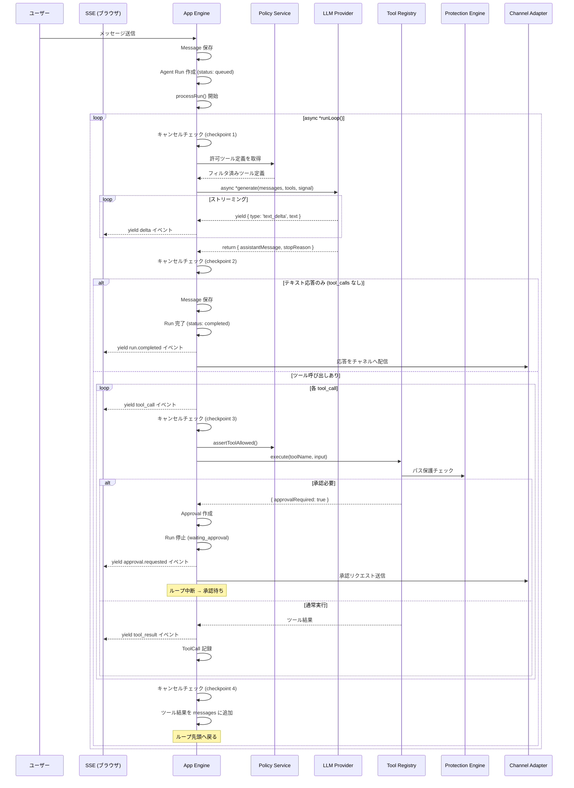
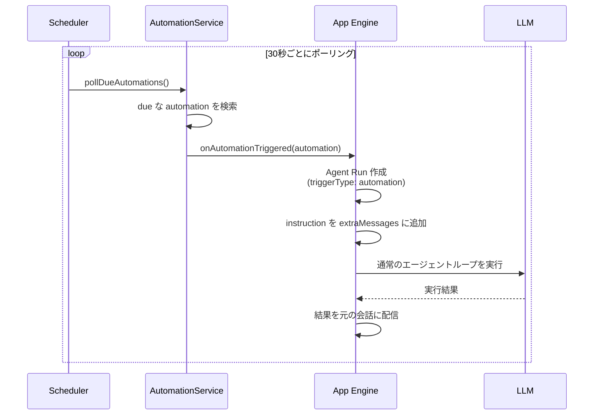

[English](../en/agent-loop.md) | 日本語

# Agent Loop

エージェントループの仕組み、承認ワークフロー、キャンセル制御、自動リカバリ、定期実行の詳細です。

---

## ループの全体像

ユーザーのメッセージからアシスタントの最終応答までの処理フローです。`processRun` は `async *runLoop()` の返すイベントを `for await` で消費し、各イベントを `emitRunEvent` 経由でSSEリスナーに配信します。



---

## Async Generator アーキテクチャ

### データフロー

```
processRun(runId)
  │
  ├─ AbortController 作成・登録
  ├─ loopMessages 構築 (snapshot or DB)
  │
  └─ for await (const event of this.runLoop({...}))
       │
       ├─ this.emitRunEvent(runId, event)
       │     └─ runEventListeners.get(conversationId)
       │           └─ 各 listener(event)  ← SSE 配信
       │
       └─ catch: classifyApiError()
             ├─ retryable → recovering → processRun 再呼出
             └─ non-retryable → failed
```

### `runLoop` が yield するイベント一覧

| イベント種別 | データ | 発生タイミング |
|---|---|---|
| `run.started` | `{ runId, status: 'running', phase: 'calling_model' }` | ループ開始直後 |
| `delta` | `{ runId, type: 'text_delta', text }` | LLMからのストリーミングチャンクごと |
| `tool_call` | `{ runId, name, input }` | ツール実行開始前 |
| `tool_result` | `{ runId, name, output }` | ツール実行完了後 |
| `approval.requested` | `{ runId, approvalId, toolName }` | 承認が必要なツール検出時 |
| `run.completed` | `{ runId, status: 'completed', finalText }` | ループ正常完了 |

### `processRun` 外から emit されるイベント

| イベント種別 | 発生タイミング |
|---|---|
| `run.cancelled` | `cancelRun()` / `finalizeCancelledRun()` 実行時 |
| `run.failed` | `processRun` の catch ブロック (非リトライエラー) |

---

## Run のライフサイクル

```
queued → running → completed
                 → failed
                 → cancelled (任意のチェックポイントで中断)
                 → waiting_approval → (approve/deny) → running → ...
                 → recovering → running → ...
                                       → failed
```

### ステータス

| ステータス | 説明 |
|---|---|
| `queued` | 実行待ち |
| `running` | ループ実行中 |
| `waiting_approval` | 人間の承認を待機中 |
| `recovering` | エラーからの自動リカバリ中 |
| `completed` | 正常完了 |
| `failed` | エラーで終了 |
| `cancelled` | ユーザーまたはシステムによりキャンセルされた |

### フェーズ

Runの中でさらに細かい状態を追跡します:

| フェーズ | 説明 |
|---|---|
| `queued` | 実行キューに入った |
| `calling_model` | LLM APIを呼び出し中 |
| `processing_response` | レスポンスを処理中 |
| `tool_results` | ツール実行結果をまとめている |
| `waiting_approval` | 承認待ち |
| `approval_resumed` | 承認後にループ再開 |
| `recovering` | リカバリ中 |
| `completed` | 完了 |
| `failed` | 失敗 |
| `cancelled` | キャンセル済み |

---

## キャンセル制御

### AbortController によるキャンセル伝播

`processRun()` は実行開始時に `AbortController` を作成し、`activeAbortControllers` マップに `runId` をキーとして登録します。`AbortSignal` はプロバイダの `generate()` に渡され、進行中のHTTPリクエストを中断できます。

```
cancelRun({ runId, actor })
  │
  ├─ Run を cancelled に更新 (DB)
  ├─ activeAbortControllers.get(runId)?.abort()
  │     └─ LLM API の fetch が AbortError を throw
  └─ emitRunEvent('run.cancelled')
```

### キャンセル可能なステータス

`cancelRun()` は以下のステータスの Run のみキャンセルできます:
- `queued`
- `running`
- `recovering`

### 4つのチェックポイント

`runLoop` 内で `isRunCancelled(runId)` を呼び出し、キャンセル済みなら `finalizeCancelledRun()` を呼んでループを終了します。

| チェックポイント | 位置 |
|---|---|
| 1 | `while` ループ先頭 |
| 2 | LLM レスポンス受信後 |
| 3 | 各ツール呼び出し前 |
| 4 | 全ツール完了後 |

さらに、プロバイダ内で `AbortError` が発生した場合もキャンセル検知として処理されます。

### `finalizeCancelledRun()`

キャンセル時の後処理を行います:

1. 部分的なアシスタントテキストがあれば `_(中断されました)_` を末尾に追加して保存
2. 未完了のツールコール（結果が返っていないもの）に対して合成 `tool_result` を挿入
3. Run のステータスを `cancelled`、フェーズを `cancelled` に更新
4. `run.cancelled` Conversation Event を記録
5. `emitRunEvent` で `run.cancelled` イベントを配信

### キャンセル API

```
POST /api/runs/:runId/cancel
```

- CSRF トークン必要
- 認証済みユーザーのみ（Run の所有者であること）
- レスポンス: `{ ok: true, data: { ok: true } }`

---

## メッセージの構築

### 新規会話

```
1. DB から全メッセージを読み込み
2. { role, content: [{ type: 'text', text }] } 形式に変換
3. プロバイダ用の正規化を実行
4. extraMessages があれば追加（automation の instruction 等）
```

### 継続ループ

ループ中は `loopMessages` がインメモリで蓄積されます:

```
[
  { role: 'user', content: [...] },           // 過去メッセージ
  { role: 'assistant', content: [...] },       // LLM応答
  { role: 'tool', content: [tool_result] },    // ツール結果
  { role: 'assistant', content: [...] },       // 次のLLM応答
  ...
]
```

この `loopMessages` は Run の `snapshot` に保存されるため、承認待ちやリカバリ後に完全な文脈で再開できます。

---

## ツール実行の詳細

### 実行フロー

```
1. Tool Policy チェック
   PolicyService.assertToolAllowed(userId, toolName)
   → 許可リストにないツールは 403

2. ツール特有の前処理
   例: delete_file は approvalGranted をチェック

3. パス解決 + File Policy チェック
   resolveProjectPath(path, context)
   → PolicyService.resolveFileAccess(userId, path)
   → File Policy のルート範囲内か確認

4. Protection Engine チェック
   assertPathActionAllowed(displayPath, action)
   → 保護ルールに該当するか確認

5. 実際のファイル操作
   fs.readFileSync, fs.writeFileSync, etc.

6. 結果の返却
   { ok: true, path, content, ... }
```

### ツール結果の記録

各ツール呼び出しは `run_tool_calls` テーブルに記録されます:

```
┌──────────┬────────────┬───────────────────┬─────────┐
│ run_id   │ tool_name  │ input_json        │ status  │
├──────────┼────────────┼───────────────────┼─────────┤
│ run-001  │ read_file  │ {"path":"src/.."}│ success │
│ run-001  │ write_file │ {"path":"src/.."}│ success │
│ run-001  │ delete_file│ {"path":"tmp/.."}│ started │
└──────────┴────────────┴───────────────────┴─────────┘
```

キャッシュ機能: 同じ Run 内で同じ `callId` のツール呼び出しが再実行される場合（リカバリ時）、前回の成功結果をキャッシュから返します。

### スキル実行

`use_skill` は特殊なツールで、SkillRegistryに登録されたスキルのプロンプトを返します。

```
LLM: use_skill({ skill_name: "code_review" })
→ { ok: true, skill: "code_review", instructions: "レビューのプロンプト..." }
→ LLM はこの instructions に従って行動する
```

### MCP ツール実行

ツール名に `__` が含まれる場合、MCP Manager にルーティングされます:

```
ツール名: github__search_repositories
  → serverName: github
  → toolName: search_repositories
  → McpClient.callTool("search_repositories", input)
  → 結果を正規化して返却
```

---

## 承認ワークフロー

### トリガー

ツールが `{ approvalRequired: true }` を返すと承認フローに入ります。

現在の実装:
- `delete_file` — `context.approvalGranted` が false のとき常に承認を要求

### 承認の処理フロー

```
1. Approval レコードを DB に保存
   - 会話ID, Run ID, ツール名, 入力パラメータ, 理由
   - status: pending

2. Run を waiting_approval に変更
   - pendingTool: { callId, name, input } を snapshot に保存

3. チャネルアダプタ経由で通知
   - Web: SSE で approval.requested イベントを配信
   - Slack: Block Kit ボタン（Approve / Deny）
   - Discord: Component ボタン（Approve / Deny）

4. 承認/拒否の受信
   - ユーザー: チャット画面 or Slack/Discord ボタン
   - 管理者: 管理画面の Approvals セクション

5. 承認された場合:
   - ツールを実際に実行（approvalGranted = true）
   - 結果を loopMessages に追加
   - Run を running に戻し、ループ再開

6. 拒否された場合:
   - "Human approval was denied." をツール結果として追加
   - Run を running に戻し、ループ再開
   - LLM は拒否を認識して別の対応を提案できる
```

---

## 自動リカバリ

### API エラーのリトライ

LLM API 呼び出しで一時的なエラーが発生した場合、自動リトライします。

```
リトライ対象 (RETRYABLE_HTTP_CODES):
  - HTTP 429, 500, 502, 503, 504, 529

ネットワークエラー:
  - ETIMEDOUT, ECONNRESET, UND_ERR_CONNECT_TIMEOUT

メッセージパターン (RETRYABLE_ERROR_PATTERNS):
  - overloaded, rate_limit, rate limit, capacity
  - temporarily unavailable, resource_exhausted
  - quota exceeded, service unavailable, try again

リトライ戦略:
  - 最大 MAX_API_RETRIES = 4 回
  - 指数バックオフ: 500ms, 1000ms, 2000ms, 4000ms
```

### エラー分類

`classifyApiError(error)` — API通信エラーを分類:
- ネットワークエラーコード (ETIMEDOUT, ECONNRESET, UND_ERR_CONNECT_TIMEOUT) → retryable
- RETRYABLE_HTTP_CODES に含まれるHTTPステータス → retryable
- メッセージが RETRYABLE_ERROR_PATTERNS にマッチ → retryable
- それ以外 → non-retryable

`classifyToolError(error)` — ツール実行エラーを分類:
- ETIMEDOUT, EBUSY, ECONNRESET → retryable
- それ以外 → non-retryable

### Run レベルのリカバリ

リトライが尽きた場合でも、Run レベルで再試行します。

```
Run 状態:
  running → recovering (リトライ可能エラー)
  recovering → running (再試行成功)
  recovering → failed (最大 MAX_RECOVERY_ATTEMPTS = 3 回に達した)
```

### サーバー再起動後のリカバリ

サーバー起動時に `recoverInterruptedRuns()` が呼ばれ、`status: recovering` の全 Run を再処理します。

```
起動時:
  1. DB から recovering 状態の Run を全取得
  2. 各 Run に対して processRun() を実行
  3. loopMessages は snapshot から復元
     → 中断前の文脈を完全に引き継ぐ
```

---

## Conversation Events

エージェントの動作はイベントとして記録されます。

| イベント種別 | 説明 |
|---|---|
| `conversation.created` | 会話が作成された |
| `message.user` | ユーザーメッセージ |
| `message.assistant` | アシスタント応答 |
| `run.queued` | Run がキューに入った |
| `run.started` | Run が開始した |
| `run.recovering` | Run がリカバリ中 |
| `run.cancelled` | Run がキャンセルされた |
| `run.failed` | Run が失敗した |
| `tool.result` | ツール実行結果 |
| `approval.requested` | 承認リクエスト |
| `approval.decided` | 承認/拒否された |
| `automation.created` | Automation が作成された |
| `automation.triggered` | Automation がトリガーされた |

イベントはオートインクリメントの整数IDを持ち、カーソルベースのストリーミングに対応しています。

---

## プロバイダーストリーミング統合

### `async *generate()` インターフェース

すべてのLLMプロバイダは `generate()` を async generator として実装しています。ストリーミング中は `{ type: 'text_delta', text }` を yield し、完了時に正規化されたレスポンスを `return` します。

```
async *generate({ messages, systemPrompt, toolDefinitions, maxTokens, signal })
  │
  ├─ yield { type: 'text_delta', text: '...' }  (繰り返し)
  │
  └─ return { assistantMessage, assistantText, stopReason }
```

`signal` パラメータ (`AbortSignal`) により、キャンセル時に進行中のHTTPリクエストを即座に中断できます。

### `wrapAsyncGenerator` ユーティリティ

`for await...of` は async generator の `return` 値（`{ value, done: true }` の `value`）を破棄します。`wrapAsyncGenerator` はこの問題を解決するラッパーです。

```javascript
// イテレータオブジェクトに .result ゲッターを追加
const genStream = provider.generate({ messages, ... })

for await (const delta of genStream) {
    // delta = { type: 'text_delta', text: '...' }
    yield { type: 'delta', runId, ...delta }
}

const result = genStream.result
// result = { assistantMessage, assistantText, stopReason }
```

### プロバイダ別の実装

| プロバイダ | ストリーミング方式 | ラッパー |
|---|---|---|
| Anthropic | `@anthropic-ai/sdk` の `messages.stream` | 独自のイテレータラッパー |
| OpenAI | `fetch` + SSE パース (`data:` 行を手動解析) | `wrapAsyncGenerator` |
| Gemini | `fetch` + SSE パース (`streamGenerateContent?alt=sse`) | `wrapAsyncGenerator` |

---

## Automation（定期実行）

### 仕組み

Automationはチャットの中でLLMがツールを使って登録する定期実行タスクです。

```
ユーザー: 「毎朝9時にdiskの使用量を確認して」

LLM → create_automation({
  name: "daily-disk-check",
  instruction: "ディスク使用量を確認してレポートしてください",
  interval_minutes: 1440
})
```

### 実行フロー



### 管理

| 操作 | ユーザー | 管理者 |
|---|---|---|
| 作成 | チャットから（ツール経由） | - |
| 一覧確認 | 自分のもの | 全Automation |
| 一時停止 | 自分のもの | 任意のAutomation |
| 再開 | 自分のもの | - |
| 削除 | 自分のもの | 任意のAutomation |
| 即時実行 | 自分のもの | - |

- 最小間隔: 5分
- デフォルトポーリング間隔: 30秒（`AUTOMATION_TICK_MS` で変更可能）
- Automationは作成したユーザーに所有され、その会話に紐づきます
