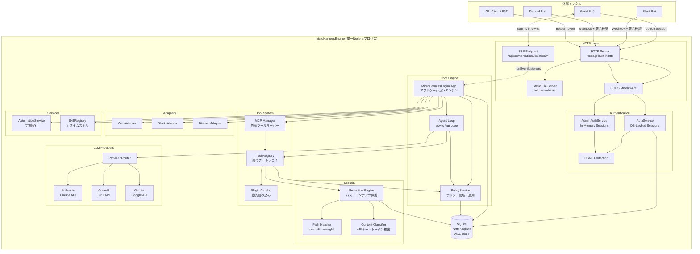
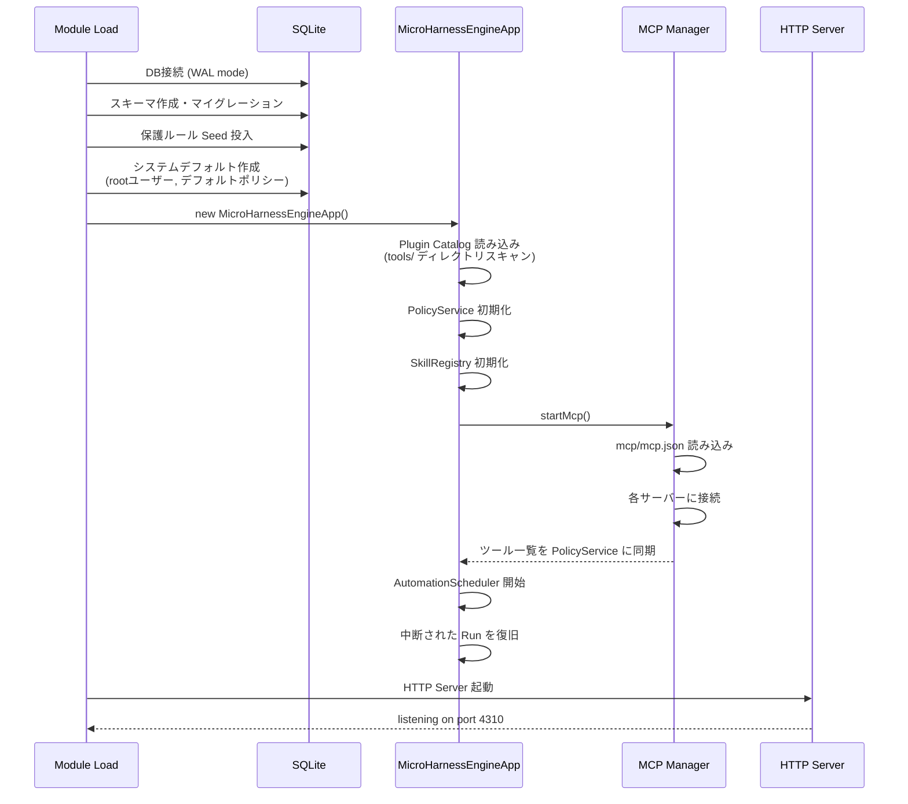

[English](../en/architecture.md) | 日本語

# Architecture

microHarnessEngineのシステム構成とデータフローの詳細です。

---

## 全体構成図



---

## コンポーネント詳細

### HTTP Server

フレームワークを使わず、Node.js 標準の `http` モジュールで構築されています。

```
リクエスト
  ├── /api/* → API Router
  │     ├── CORS ヘッダ適用
  │     ├── OPTIONS → 204 (preflight)
  │     ├── Actor 解決 (Bearer token / Session cookie)
  │     ├── GET /api/conversations/:id/stream → SSE ストリーミング
  │     ├── POST /api/runs/:runId/cancel → キャンセル
  │     └── ルートディスパッチ
  └── その他 → Static File Server (SPA)
        └── admin-web/dist/index.html へフォールバック
```

ルーティングは `:param` 形式のパスパラメータをサポートするカスタムマッチャーを使用します。

### MicroHarnessEngineApp (アプリケーションエンジン)

システムの中心。以下を統括します:

- 会話の作成・取得
- メッセージの受信とエージェント実行の開始
- 承認ワークフロー
- 自動化タスクの管理
- チャネルアダプタへの応答配信
- MCP サーバー管理
- スキル管理
- SSE イベントリスナー管理
- Run キャンセル制御

#### SSE リスナー管理メソッド

| メソッド | 説明 |
|---|---|
| `addRunEventListener(conversationId, listener)` | SSE リスナーを登録 |
| `removeRunEventListener(conversationId, listener)` | SSE リスナーを解除 |
| `emitRunEvent(runId, event)` | 全リスナーにイベントを配信 |

#### キャンセル制御メソッド

| メソッド | 説明 |
|---|---|
| `cancelRun({ runId, actor })` | Run をキャンセル、AbortController を abort |
| `isRunCancelled(runId)` | Run がキャンセル済みかチェック |
| `getAbortSignal(runId)` | Run の AbortSignal を取得 |
| `finalizeCancelledRun(runId, loopMessages, conversation)` | キャンセル後処理 (部分テキスト保存等) |

### 認証の分離

```
┌─────────────────────┬──────────────────────────┐
│   User Auth         │   Admin Auth             │
├─────────────────────┼──────────────────────────┤
│ DB-backed sessions  │ In-Memory sessions       │
│ Rolling expiry      │ 固定 expiry              │
│ Cookie + Bearer     │ Cookie のみ              │
│ CSRF (session時)    │ CSRF (常時)              │
│ PAT 発行可能        │ PAT なし                 │
│ 再起動で維持        │ 再起動で消失             │
└─────────────────────┴──────────────────────────┘
```

Admin認証がDBに保存されない設計は意図的です。管理者セッションの永続化は攻撃面を広げるため、揮発性を選択しています。

### Tool Registry (実行ゲートウェイ)

すべてのツール実行はTool Registryを経由します。

```
ツール実行リクエスト
  │
  ├── 1. PolicyService.assertToolAllowed()
  │     → ユーザーの Tool Policy をチェック
  │     → 許可されていなければ 403
  │
  ├── 2. tool.execute(input, context)
  │     └── 内部で resolveProjectPath() を呼び出し
  │           ├── PolicyService.resolveFileAccess()
  │           │   → File Policy をチェック
  │           └── Protection Engine
  │               → パス保護ルールをチェック
  │
  └── 3. ProtectionError → createProtectionResult()
        → LLMにユーザーへの手動操作案内を返す
```

### Plugin Catalog (動的プラグイン読み込み)

```
起動時:
  tools/ ディレクトリをスキャン
    └── 各サブディレクトリの index.js を動的 import
          └── plugin オブジェクトを検証
                ├── name: string (必須)
                ├── description: string
                └── tools: Array (必須)
                      └── 各 tool: { name, execute, ... }

ツール名の重複は起動時にエラーとして検出されます。
```

### LLM Provider

3つのプロバイダが共通のインターフェースを実装しています。

```
Provider Interface:
  ├── name: string
  ├── displayName: string
  ├── getModel(): string
  ├── capabilities: { toolCalling, parallelToolCalls, ... }
  └── async *generate({ messages, systemPrompt, toolDefinitions, maxTokens, signal })
        ├── yield { type: 'text_delta', text }  (ストリーミング)
        └── return { assistantMessage, assistantText, stopReason }
```

`generate()` は async generator として実装され、ストリーミング中はテキストデルタを yield し、完了時に正規化されたレスポンスを return します。`signal` パラメータ (`AbortSignal`) によりキャンセル時の即時中断が可能です。

内部メッセージ形式は正規化レイヤー (`common.js`) で統一されています:

```
正規化メッセージ形式:
  { role: 'user' | 'assistant' | 'tool',
    content: [
      { type: 'text', text: string }
      { type: 'tool_call', callId, name, input }
      { type: 'tool_result', callId, name, output }
    ]
  }
```

各プロバイダの `generate()` は:
1. 正規化メッセージ → プロバイダ固有形式に変換
2. ストリーミングAPI呼び出し（テキストデルタを yield）
3. レスポンス → 正規化形式に変換して return

---

## SSE ストリーミング

### 通信フロー

```mermaid
sequenceDiagram
    participant Browser as ブラウザ (lib/sse.js)
    participant Server as HTTP Server
    participant App as MicroHarnessEngineApp
    participant Loop as runLoop()

    Browser->>Server: GET /api/conversations/:id/stream
    Server->>Server: レスポンスヘッダ設定<br/>(text/event-stream)
    Server-->>Browser: : connected

    Server->>App: addRunEventListener(conversationId, listener)

    loop ハートビート (30秒間隔)
        Server-->>Browser: : heartbeat
    end

    Loop->>App: emitRunEvent(runId, event)
    App->>Server: listener(event)
    Server-->>Browser: event: delta\ndata: {"type":"text_delta","text":"..."}

    Browser->>Browser: 接続クローズ
    Server->>App: removeRunEventListener(conversationId, listener)
```

### サーバー側 SSE レスポンス

| ヘッダ | 値 |
|---|---|
| `Content-Type` | `text/event-stream` |
| `Cache-Control` | `no-cache` |
| `Connection` | `keep-alive` |
| `X-Accel-Buffering` | `no` |

初期接続時に `: connected\n\n` コメントを送信します。30秒間隔で `: heartbeat\n\n` コメントを送信し、接続を維持します。

### クライアント側 SSE (lib/sse.js)

`EventSource` API ではなく `fetch()` + `ReadableStream` による独自実装です:

- `credentials: 'include'` で Cookie 認証
- レスポンスボディを `getReader()` でチャンク単位に読み取り
- `\n\n` でイベント境界を分割、`event:` と `data:` 行を解析
- `:` で始まるコメント行（ハートビート）は無視
- `{ close() }` を返し、`AbortController.abort()` で接続を切断

### フォールバック仕様

SSE 接続でエラーが発生した場合、4秒間隔のポーリング (`loadWorkspace()`) にフォールバックします。SSE の再接続は自動的には行われません（コンポーネント再マウントまで）。

---

## 起動シーケンス



---

## シャットダウンシーケンス

`SIGTERM` / `SIGINT` を受信すると:

1. AutomationScheduler を停止
2. MCP Manager を停止（全サーバー切断）
3. HTTP Server をクローズ
4. 10秒後に強制終了（グレースフル停止が完了しない場合）

---

## ディレクトリ構造

```
src/
├── index.js                      # エントリポイント (startApiServer)
├── cli-root.js                   # CLI エントリポイント
├── http/
│   └── server.js                 # HTTPサーバー + 全APIルート定義 + SSE
├── core/
│   ├── app.js                    # MicroHarnessEngineApp クラス
│   ├── config.js                 # 環境変数ベースの設定
│   ├── store.js                  # SQLite データアクセス層 (全テーブル定義)
│   ├── http.js                   # HttpError クラス
│   ├── security.js               # 暗号化・Cookie・署名検証
│   ├── authService.js            # ユーザー認証サービス
│   ├── adminAuthService.js       # 管理者認証サービス (in-memory)
│   ├── policyService.js          # ポリシー管理・実行時適用
│   ├── automationService.js      # 定期実行管理
│   ├── skillRegistry.js          # カスタムスキル管理 (Markdownファイル)
│   ├── systemDefaults.js         # システムデフォルト定数
│   ├── adapters/
│   │   ├── index.js              # アダプタ登録
│   │   ├── web.js                # Web (stub, SSEで配信)
│   │   ├── slack.js              # Slack Events API + Block Kit
│   │   └── discord.js            # Discord Interactions
│   ├── tools/
│   │   ├── registry.js           # ツール実行ゲートウェイ
│   │   ├── catalog.js            # プラグイン動的読み込み
│   │   └── helpers.js            # パス解決・保護チェックヘルパー
│   └── cli/
│       └── rootCli.js            # CLIコマンド定義
├── protection/
│   ├── service.js                # Protection Engine 本体
│   ├── matcher.js                # パスマッチング (exact/dirname/glob)
│   ├── classifier.js             # 機密情報パターン検出・redaction
│   ├── defaultRules.js           # デフォルト保護ルール
│   ├── errors.js                 # ProtectionError 型
│   └── api.js                    # 保護ルール管理API
├── providers/
│   ├── index.js                  # プロバイダルーター
│   ├── common.js                 # メッセージ正規化・ユーティリティ
│   ├── anthropic.js              # Claude API (@anthropic-ai/sdk)
│   ├── openai.js                 # OpenAI API (fetch ベース)
│   └── gemini.js                 # Gemini API (fetch ベース)
├── mcp/
│   ├── index.js                  # McpManager (複数サーバー管理)
│   ├── client.js                 # McpClient (単一サーバー接続)
│   ├── transport.js              # StdioTransport / HttpTransport
│   ├── config.js                 # mcp.json 読み書き
│   └── protocol.js               # MCP プロトコルヘルパー
└── admin-web/                    # React + Vite SPA
    └── src/
        ├── lib/
        │   ├── api.js            # axios ベースの API クライアント
        │   ├── axios.js          # axios インスタンス + インターセプタ
        │   ├── sse.js            # SSE クライアント (fetch + ReadableStream)
        │   ├── motion.js         # framer-motion プリセット
        │   ├── navigateRef.js    # 非React コードからの navigate ブリッジ
        │   └── utils.js          # cn() ユーティリティ
        ├── stores/
        │   ├── workspace.js      # workspaceAtom, selectedConversationIdAtom 等
        │   ├── ui.js             # themeAtom, workspaceBusyKeyAtom 等
        │   ├── auth.js           # authStateAtom, adminAuthStateAtom
        │   └── admin.js          # adminDataAtom
        ├── hooks/
        │   ├── useWorkspace.js   # SSE接続・ポーリング・全ワークスペース操作
        │   ├── useAuth.js        # ユーザー認証
        │   ├── useAdmin.js       # 管理者操作
        │   └── useTheme.js       # テーマ切替
        └── components/
            ├── chat/
            │   ├── MessageList.jsx      # メッセージ一覧 + StreamingBubble
            │   ├── MessageBubble.jsx    # メッセージ表示 + ToolMessage
            │   ├── ChatInput.jsx        # 入力フォーム + Run状態表示
            │   └── ConversationSidebar.jsx  # 会話一覧サイドバー
            └── shared/
                └── ProtectedRoute.jsx   # 認証ガード
```
