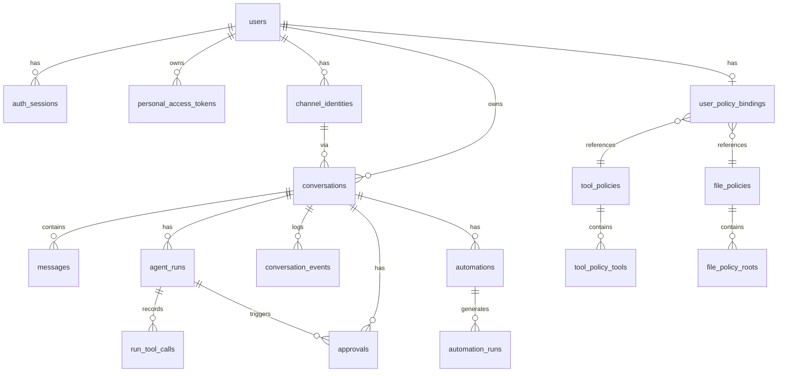

[English](../en/data-model.md) | 日本語

# Data Model

SQLiteデータベースのスキーマとリレーションの詳細です。

---

## ER図

---

## テーブル詳細

### users

ユーザーアカウント。

| カラム | 型 | 制約 | 説明 |
|---|---|---|---|
| `id` | TEXT | PK | UUID |
| `login_name` | TEXT | UNIQUE | ログイン名（小文字） |
| `email` | TEXT | UNIQUE | メール（レガシー、未使用） |
| `display_name` | TEXT | NOT NULL | 表示名 |
| `password_hash` | TEXT | | scryptハッシュ |
| `password_salt` | TEXT | | ソルト |
| `role` | TEXT | NOT NULL, DEFAULT 'user' | `user` / `admin` |
| `status` | TEXT | NOT NULL, DEFAULT 'active' | `active` / `inactive` |
| `auth_source` | TEXT | NOT NULL, DEFAULT 'local' | `local` / `system` / `slack` / `discord` |
| `system_user_type` | TEXT | UNIQUE | `root`（特殊ユーザー識別） |
| `created_at` | TEXT | NOT NULL | 作成日時 |
| `updated_at` | TEXT | NOT NULL | 更新日時 |
| `last_login_at` | TEXT | | 最終ログイン日時 |

### auth_sessions

ユーザーセッション（DB永続化）。

| カラム | 型 | 制約 | 説明 |
|---|---|---|---|
| `id` | TEXT | PK | セッションID |
| `user_id` | TEXT | FK → users | ユーザーID |
| `csrf_token` | TEXT | NOT NULL | CSRFトークン |
| `expires_at` | TEXT | NOT NULL | 有効期限 |
| `created_at` | TEXT | NOT NULL | 作成日時 |
| `last_seen_at` | TEXT | NOT NULL | 最終アクセス日時 |
| `user_agent` | TEXT | | ブラウザ情報 |
| `ip_hash` | TEXT | | IPアドレスのSHA-256 |

### personal_access_tokens

APIアクセストークン。

| カラム | 型 | 制約 | 説明 |
|---|---|---|---|
| `id` | TEXT | PK | UUID |
| `user_id` | TEXT | FK → users | 所有者 |
| `name` | TEXT | NOT NULL | トークン名 |
| `token_hash` | TEXT | UNIQUE, NOT NULL | SHA-256ハッシュ（生トークンは保存しない） |
| `created_at` | TEXT | NOT NULL | 発行日時 |
| `last_used_at` | TEXT | | 最終使用日時 |
| `revoked_at` | TEXT | | 失効日時 |

### channel_identities

チャネル連携のアイデンティティ。

| カラム | 型 | 制約 | 説明 |
|---|---|---|---|
| `id` | TEXT | PK | UUID |
| `user_id` | TEXT | FK → users | ユーザーID |
| `type` | TEXT | NOT NULL | `web` / `slack` / `discord` |
| `identity_key` | TEXT | UNIQUE, NOT NULL | `web:{userId}`, `slack:{team}:{user}:{channel}` 等 |
| `display_label` | TEXT | NOT NULL | 表示ラベル |
| `status` | TEXT | NOT NULL | `active` |
| `metadata_json` | TEXT | | チャネル固有メタデータ (JSON) |

### conversations

会話。

| カラム | 型 | 制約 | 説明 |
|---|---|---|---|
| `id` | TEXT | PK | UUID |
| `user_id` | TEXT | FK → users | 所有者 |
| `channel_identity_id` | TEXT | FK → channel_identities | チャネル |
| `title` | TEXT | NOT NULL | 会話タイトル |
| `status` | TEXT | NOT NULL | `active` |
| `source` | TEXT | NOT NULL | `web` / `slack` / `discord` |
| `external_ref` | TEXT | | Slack thread ts, Discord session等 |
| `last_message_at` | TEXT | | 最新メッセージ日時 |

UNIQUE制約: `(channel_identity_id, external_ref)`

### messages

メッセージ。

| カラム | 型 | 制約 | 説明 |
|---|---|---|---|
| `id` | TEXT | PK | UUID |
| `conversation_id` | TEXT | FK → conversations | 会話ID |
| `role` | TEXT | NOT NULL | `user` / `assistant` / `tool` |
| `author_user_id` | TEXT | FK → users | 送信者（NULLあり） |
| `content_text` | TEXT | NOT NULL | テキスト内容 |
| `content_json` | TEXT | | 構造化コンテンツ (JSON) |
| `created_at` | TEXT | NOT NULL | 送信日時 |

### agent_runs

エージェント実行。

| カラム | 型 | 制約 | 説明 |
|---|---|---|---|
| `id` | TEXT | PK | UUID |
| `conversation_id` | TEXT | FK → conversations | 会話ID |
| `status` | TEXT | NOT NULL | `queued`/`running`/`waiting_approval`/`recovering`/`completed`/`failed` |
| `trigger_type` | TEXT | NOT NULL | `user_message`/`external_message`/`automation` |
| `trigger_message_id` | TEXT | | トリガーメッセージID |
| `automation_id` | TEXT | | トリガーAutomation ID |
| `provider_name` | TEXT | NOT NULL | LLMプロバイダ名 |
| `phase` | TEXT | NOT NULL | 詳細フェーズ |
| `snapshot_json` | TEXT | | ループ状態のスナップショット (JSON) |
| `last_error` | TEXT | | 最終エラー |
| `completed_at` | TEXT | | 完了日時 |

`snapshot_json` にはループメッセージ全体が保存され、リカバリ時に文脈を復元できます。

### run_tool_calls

ツール呼び出しの記録。

| カラム | 型 | 制約 | 説明 |
|---|---|---|---|
| `id` | INTEGER | PK AUTOINCREMENT | |
| `run_id` | TEXT | NOT NULL | 実行ID |
| `tool_use_id` | TEXT | NOT NULL | LLMのtool_call ID |
| `tool_name` | TEXT | NOT NULL | ツール名 |
| `input_json` | TEXT | | 入力パラメータ (JSON) |
| `output_json` | TEXT | | 出力結果 (JSON) |
| `status` | TEXT | NOT NULL | `started`/`success`/`error` |
| `error_text` | TEXT | | エラーメッセージ |

UNIQUE制約: `(run_id, tool_use_id)` — リカバリ時のキャッシュに使用

### conversation_events

会話イベントストリーム。

| カラム | 型 | 制約 | 説明 |
|---|---|---|---|
| `id` | INTEGER | PK AUTOINCREMENT | カーソル用連番 |
| `event_id` | TEXT | UNIQUE, NOT NULL | UUID |
| `conversation_id` | TEXT | FK → conversations | 会話ID |
| `run_id` | TEXT | | 実行ID |
| `kind` | TEXT | NOT NULL | イベント種別 |
| `payload_json` | TEXT | NOT NULL | イベントデータ (JSON) |
| `created_at` | TEXT | NOT NULL | 発生日時 |

### approvals

承認リクエスト。

| カラム | 型 | 制約 | 説明 |
|---|---|---|---|
| `id` | TEXT | PK | UUID |
| `conversation_id` | TEXT | FK → conversations | 会話ID |
| `run_id` | TEXT | FK → agent_runs | 実行ID |
| `requester_user_id` | TEXT | FK → users | リクエスト者 |
| `channel_identity_id` | TEXT | FK → channel_identities | チャネル |
| `tool_name` | TEXT | NOT NULL | ツール名 |
| `tool_input_json` | TEXT | NOT NULL | ツール入力 (JSON) |
| `reason` | TEXT | NOT NULL | 承認理由 |
| `status` | TEXT | NOT NULL | `pending`/`approved`/`denied` |
| `requested_at` | TEXT | NOT NULL | リクエスト日時 |
| `expires_at` | TEXT | | 期限 |
| `decided_at` | TEXT | | 決定日時 |
| `decided_by_user_id` | TEXT | | 決定者（管理者はNULL） |
| `decision_note` | TEXT | | 決定メモ |

### automations

定期実行タスク。

| カラム | 型 | 制約 | 説明 |
|---|---|---|---|
| `id` | TEXT | PK | UUID |
| `owner_user_id` | TEXT | FK → users | 所有者 |
| `channel_identity_id` | TEXT | FK → channel_identities | チャネル |
| `conversation_id` | TEXT | FK → conversations | 会話ID |
| `name` | TEXT | NOT NULL | タスク名 |
| `instruction` | TEXT | NOT NULL | 実行内容 |
| `schedule_kind` | TEXT | NOT NULL | `interval` |
| `interval_minutes` | INTEGER | NOT NULL | 実行間隔（分、最小5） |
| `status` | TEXT | NOT NULL | `active`/`paused`/`deleted` |
| `next_run_at` | TEXT | NOT NULL | 次回実行日時 |
| `last_run_at` | TEXT | | 前回実行日時 |

### automation_runs

Automation実行の記録。

| カラム | 型 | 制約 | 説明 |
|---|---|---|---|
| `id` | TEXT | PK | UUID |
| `automation_id` | TEXT | FK → automations | Automation ID |
| `conversation_id` | TEXT | FK → conversations | 会話ID |
| `run_id` | TEXT | | Agent Run ID |
| `status` | TEXT | NOT NULL | `started`/`queued`/`failed` |
| `error_text` | TEXT | | エラーメッセージ |

---

## ポリシー関連テーブル

### tool_policies

| カラム | 型 | 制約 | 説明 |
|---|---|---|---|
| `id` | TEXT | PK | UUID |
| `name` | TEXT | UNIQUE, NOT NULL | ポリシー名 |
| `description` | TEXT | | 説明 |
| `is_system` | INTEGER | NOT NULL, DEFAULT 0 | システムポリシーフラグ |

### tool_policy_tools

| カラム | 型 | 制約 | 説明 |
|---|---|---|---|
| `policy_id` | TEXT | PK, FK → tool_policies | ポリシーID |
| `tool_name` | TEXT | PK | 許可されたツール名 |

### file_policies

| カラム | 型 | 制約 | 説明 |
|---|---|---|---|
| `id` | TEXT | PK | UUID |
| `name` | TEXT | UNIQUE, NOT NULL | ポリシー名 |
| `description` | TEXT | | 説明 |
| `is_system` | INTEGER | NOT NULL, DEFAULT 0 | システムポリシーフラグ |

### file_policy_roots

| カラム | 型 | 制約 | 説明 |
|---|---|---|---|
| `id` | TEXT | PK | UUID |
| `policy_id` | TEXT | FK → file_policies | ポリシーID |
| `scope` | TEXT | NOT NULL | `workspace` / `absolute` |
| `root_path` | TEXT | NOT NULL | 許可パス |
| `path_type` | TEXT | NOT NULL | `dir` / `file` |

UNIQUE制約: `(policy_id, scope, root_path, path_type)`

### user_policy_bindings

| カラム | 型 | 制約 | 説明 |
|---|---|---|---|
| `user_id` | TEXT | PK, FK → users | ユーザーID |
| `tool_policy_id` | TEXT | FK → tool_policies | Tool Policy |
| `file_policy_id` | TEXT | FK → file_policies | File Policy |

---

## 保護関連テーブル

### protection_rules

| カラム | 型 | 制約 | 説明 |
|---|---|---|---|
| `id` | TEXT | PK | UUID |
| `pattern` | TEXT | NOT NULL | マッチングパターン |
| `pattern_type` | TEXT | NOT NULL | `exact` / `dirname` / `glob` |
| `effect` | TEXT | NOT NULL, DEFAULT 'deny' | `deny` / `ask` / `allow` |
| `priority` | INTEGER | NOT NULL, DEFAULT 100 | 優先度（小さいほど優先） |
| `enabled` | INTEGER | NOT NULL, DEFAULT 1 | 有効フラグ |
| `scope` | TEXT | NOT NULL, DEFAULT 'workspace' | `system` / `workspace` |
| `note` | TEXT | | 説明 |

UNIQUE制約: `(pattern, pattern_type, scope)`

### protection_audit_logs

| カラム | 型 | 制約 | 説明 |
|---|---|---|---|
| `id` | TEXT | PK | UUID |
| `session_token` | TEXT | | セッショントークン |
| `action` | TEXT | NOT NULL | `discover`/`read`/`write`/`move`/`delete` |
| `target_path` | TEXT | | 対象パス |
| `sink` | TEXT | | 送信先 |
| `decision` | TEXT | NOT NULL | `allow`/`deny`/`ask` |
| `matched_rule_id` | TEXT | | マッチしたルールID |
| `reason` | TEXT | | 理由 |

---

## 初期データ

サーバー起動時に自動作成されるデータ:

| データ | 説明 |
|---|---|
| `root` ユーザー | システム管理者（削除・無効化不可） |
| Default Tool Policy | 全ツール拒否（`is_system: 1`） |
| System All Tools Policy | 全ツール許可（`is_system: 1`、自動同期） |
| Default File Policy | ワークスペースのみ（`is_system: 1`、root: `.`） |
| デフォルト保護ルール | `.env`, `security/`, `secrets/` 等（6ルール） |
| root の Policy Binding | System All Tools + Default File Policy |
