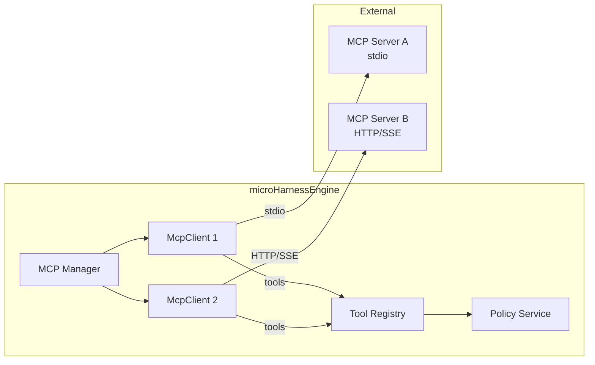
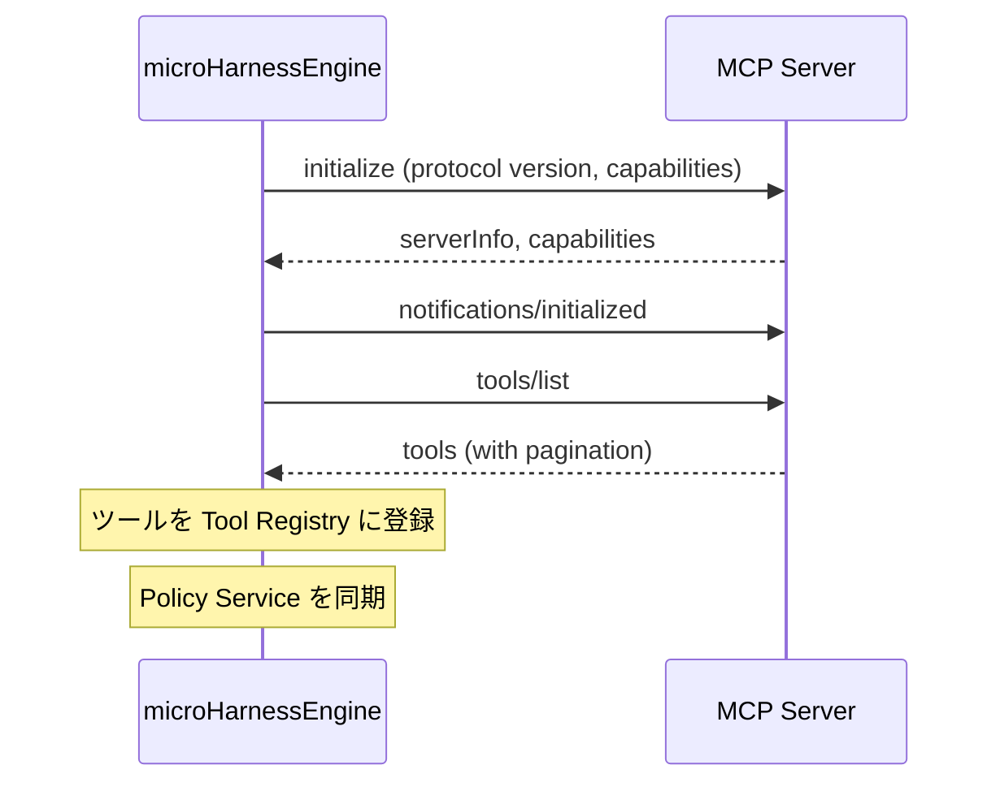

# MCP Integration

Model Context Protocol (MCP) サーバーとの連携方法です。

---

## 概要

microHarnessEngineはMCPクライアントを内蔵しており、外部のMCPサーバーを接続してツールとして統合できます。



MCPサーバーのツールもTool Policyの管理対象です。管理者が明示的に許可しない限り、ユーザーはMCPツールを使用できません。

---

## 設定ファイル

MCPサーバーの設定は `mcp/mcp.json` に保存されます。フォーマットはClaude Desktop互換です。

```json
{
  "mcpServers": {
    "github": {
      "command": "npx",
      "args": ["-y", "@modelcontextprotocol/server-github"],
      "env": {
        "GITHUB_TOKEN": "ghp_xxxx"
      }
    },
    "remote-api": {
      "url": "https://mcp.example.com/sse",
      "headers": {
        "Authorization": "Bearer token123"
      }
    }
  }
}
```

> `mcp/mcp.json` はデフォルトの保護ルールで保護されています（APIキーが含まれるため）。

---

## トランスポート

### stdio トランスポート

子プロセスとしてMCPサーバーを起動し、stdin/stdoutで通信します。

```json
{
  "command": "npx",
  "args": ["-y", "@modelcontextprotocol/server-github"],
  "env": {
    "GITHUB_TOKEN": "ghp_xxxx"
  }
}
```

| 設定 | 説明 |
|---|---|
| `command` | 実行するコマンド |
| `args` | コマンド引数の配列 |
| `env` | 環境変数（`process.env` にマージ） |

- Windowsでは `shell: true` で起動
- プロセス終了時は自動検知
- サーバー停止時は SIGTERM → 5秒後に SIGKILL

### HTTP トランスポート（Streamable HTTP + SSE）

HTTP経由でMCPサーバーと通信します。

```json
{
  "url": "https://mcp.example.com/sse",
  "headers": {
    "Authorization": "Bearer token123"
  }
}
```

| 設定 | 説明 |
|---|---|
| `url` | MCPサーバーのURL |
| `headers` | リクエストヘッダ |

- セッションID管理（`Mcp-Session-Id` ヘッダ）
- SSEストリームの自動接続
- POST レスポンスのSSEもサポート

---

## 接続フロー



### 再接続

接続エラー時は自動的に再接続を試みます:

- 最大3回
- 指数バックオフ: 2秒, 4秒, 6秒
- すべて失敗すると `state: failed`

### ツール変更通知

MCPサーバーが `notifications/tools/list_changed` を送信すると、自動的にツール一覧を再取得します。

---

## ツールの名前空間

MCPツールは `サーバー名__ツール名` の形式で登録されます。

```
github__search_repositories
github__create_issue
slack__post_message
```

この名前空間により:
- 複数のMCPサーバー間でツール名が衝突しない
- Tool Policy で個別に許可/拒否できる
- LLMがどのサーバーのツールかを識別できる

---

## ツール結果の正規化

MCPサーバーの応答はmicroHarnessEngineの内部形式に正規化されます:

| MCPレスポンス | 変換結果 |
|---|---|
| `isError: true` | `{ ok: false, error: "..." }` |
| テキスト1件 | JSON解析を試み、`{ ok: true, result: ... }` |
| テキスト複数件 | 改行で結合、`{ ok: true, result: "..." }` |
| 非テキスト (画像等) | `{ ok: true, result: { type, mimeType } }` |

---

## 管理画面からの操作

管理画面 → **MCP Servers** セクションで以下の操作が可能です:

| 操作 | 説明 |
|---|---|
| **一覧** | 全サーバーの接続状態・ツール数・最終エラー |
| **追加** | 新しいMCPサーバーを追加 |
| **編集** | サーバー設定を変更（再接続が発生） |
| **削除** | サーバーを切断・設定を削除 |
| **再接続** | 切断されたサーバーに再接続 |

機密情報（`env`, `headers`）は管理画面上では `***` にマスクされます。

### 追加時の注意

- サーバー名: `[a-zA-Z0-9_-]`、最大64文字
- 設定には `command` または `url` のいずれかが必要
- サーバー追加後、そのツールを使うには Tool Policy への追加が必要

---

## API

| メソッド | パス | 説明 |
|---|---|---|
| `GET` | `/api/admin/mcp-servers` | サーバー一覧 |
| `POST` | `/api/admin/mcp-servers` | サーバー追加 |
| `PATCH` | `/api/admin/mcp-servers/:name` | 設定変更 |
| `DELETE` | `/api/admin/mcp-servers/:name` | 削除 |
| `POST` | `/api/admin/mcp-servers/:name/reconnect` | 再接続 |

---

## Policy との統合

MCPサーバーの接続・切断時、`PolicyService.syncSystemPolicies()` が呼ばれ、**System All Tools** ポリシーが自動更新されます。

つまり:
- `root` ユーザー（System All Tools 割り当て）は新しいMCPツールをすぐに使える
- 他のユーザーは管理者がTool Policyに追加するまで使えない（Default Deny）
