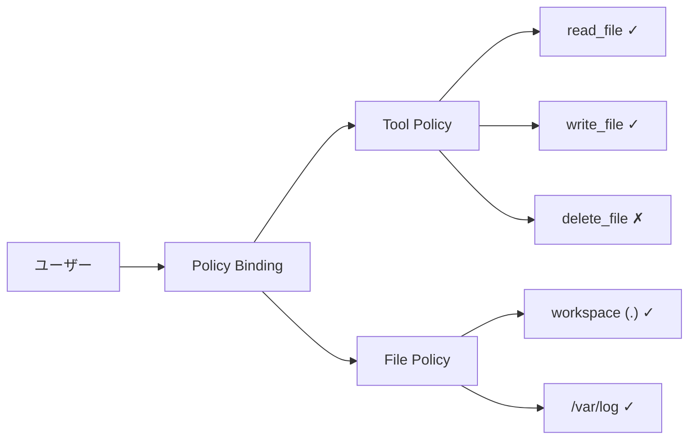

# Policy Guide

microHarnessEngineのポリシーシステムの仕組みと設定方法です。

---

## 概要

microHarnessEngineは2種類のポリシーでアクセス制御を行います:

| ポリシー | 制御対象 | 方式 |
|---|---|---|
| **Tool Policy** | ユーザーが使えるツール | ホワイトリスト |
| **File Policy** | ユーザーがアクセスできるパス | ルートパス指定 |

各ユーザーには **Tool Policy を1つ** と **File Policy を1つ** 割り当てます。



---

## Tool Policy

### 仕組み

Tool Policyは「このユーザーが使用できるツール」のホワイトリストです。

- リストに含まれるツール → 使用可能
- リストに含まれないツール → 拒否（403）

**LLMに渡されるツール定義自体がフィルタされます。** 許可されていないツールはLLMに存在を知らされません。

```
ツール実行時:
  1. LLMへの送信前: 許可ツールだけをtool定義に含める
  2. 実行時: assertToolAllowed() で再チェック（二重防御）
```

### システムポリシー

初期状態で2つのシステムポリシーが存在します:

| ポリシー名 | 説明 | 編集 | 削除 |
|---|---|---|---|
| **Default (deny all)** | ツールを一切許可しない | 不可 | 不可 |
| **System All Tools** | 登録された全ツールを自動許可 | 不可 | 不可 |

- 新規ユーザーには **Default** が割り当てられます
- `root` ユーザーには **System All Tools** が割り当てられます
- **System All Tools** はツールの追加・MCP接続時に自動更新されます

### カスタムポリシーの作成

管理画面 → **Tool Policies** → 「Create」から作成します。

```
名前: developer-readonly
説明: 読み取り系ツールのみ

許可ツール:
  ☑ list_files
  ☑ read_file
  ☑ glob
  ☑ grep
  ☐ write_file
  ☐ edit_file
  ☐ delete_file
  ...
```

### ツール選択のガイドライン

**安全（読み取り）**:
- `list_files` — ファイル一覧
- `read_file` — ファイル読み取り
- `glob` — パターン検索
- `grep` — 内容検索
- `git_info` — Gitリポジトリ情報

**中程度（書き込み）**:
- `write_file` — ファイル作成・上書き
- `edit_file` — 差分ベース編集
- `multi_edit_file` — 複数箇所一括編集
- `make_dir` — ディレクトリ作成
- `move_file` — 移動・リネーム
- `git_commit` — コミット作成

**高リスク（破壊的・外部通信）**:
- `delete_file` — ファイル削除（承認必要）
- `git_push` — リモートプッシュ
- `git_dangerous` — 破壊的Gitコマンド（承認必要）
- `web_fetch` — 外部URL取得
- `web_search` — Web検索

**自動化**:
- `create_automation` — 定期実行タスク作成
- `list_automations` — タスク一覧
- `pause_automation` / `resume_automation` / `delete_automation`

### MCP ツール

MCP サーバー経由のツールは `servername__toolname` の形式で表示されます。

例: `github__search_repositories`, `slack__post_message`

これらもTool Policyのホワイトリストで個別に制御できます。

### ポリシーの削除

ユーザーに割り当てられているポリシーを削除する場合、代替ポリシーを指定する必要があります。該当ユーザーは自動的に代替ポリシーに移行されます。

---

## File Policy

### 仕組み

File Policyは「このユーザーがアクセスできるパス」をルートパスの集合で定義します。

```
File Policy のルート:
  ├── workspace: .          (ワークスペース = プロジェクトルート配下)
  ├── absolute: /var/log    (プロジェクト外の特定パス)
  └── absolute: /etc/nginx  (プロジェクト外の特定パス)

→ ツールがアクセスするパスは、いずれかのルートの配下でなければ拒否
```

### ルートの種類

| Scope | 説明 | パス解決 |
|---|---|---|
| `workspace` | プロジェクトルートからの相対パス | `PROJECT_ROOT + rootPath` |
| `absolute` | 絶対パスで指定 | そのまま使用 |

| Path Type | 説明 |
|---|---|
| `dir` | ディレクトリとその配下すべてにアクセス可能 |
| `file` | 特定のファイル1つだけにアクセス可能 |

### システムポリシー

| ポリシー名 | ルート | 説明 |
|---|---|---|
| **Default (workspace only)** | `workspace: .` | ワークスペース配下のみ |

全ユーザーに初期割り当てされます。カスタムポリシーを割り当てた場合も、ワークスペースへのアクセスは常に保証されます。

### カスタムポリシーの作成

管理画面 → **File Policies** → 「Create」から作成します。

```
名前: devops-access
説明: ワークスペース + ログ + Nginx設定

ルート:
  + workspace: .           (dir)  ← デフォルトで含まれる
  + absolute: /var/log     (dir)
  + absolute: /etc/nginx   (dir)
```

### パスの検証

管理画面には **Probe** 機能があり、パスの状態を事前確認できます:

```
入力: /var/log/myapp
結果:
  absolutePath: /var/log/myapp
  exists: true
  isWorkspace: false
  pathType: dir
```

`absolute` スコープのルートを追加する場合、そのパスが実際に存在する必要があります。

### パス解決の仕組み

ツールがパスにアクセスする際の解決順序:

```
1. ユーザーの File Policy のルート一覧を取得
2. カスタムポリシーでも、デフォルトのワークスペースルートを自動追加
3. 対象パスを絶対パスに解決
4. シンボリックリンクを解決（realpath経由）
5. いずれかのルートの配下であることを確認
   → 該当なし: 403 エラー
6. Protection Engine のチェックを通過
   → 保護対象: ProtectionError
```

### Windows対応

パス比較はプラットフォームを考慮しています:
- Windows: 大文字小文字を無視して比較
- Linux/macOS: 大文字小文字を区別

---

## ポリシーの割り当て

### 管理画面から

**Users** → ユーザーを選択 → **Policies** で:
- Tool Policy を選択
- File Policy を選択

### API から

```
PATCH /api/admin/users/:userId/policies
{
  "toolPolicyId": "policy-uuid-1",
  "filePolicyId": "policy-uuid-2"
}
```

### 割り当ての即時反映

ポリシーの変更はリアルタイムに反映されます。進行中のエージェント実行でも、次のツール呼び出し時に新しいポリシーが適用されます。

---

## ポリシー設計の例

### 例1: 閲覧専用ユーザー

```
Tool Policy: readonly
  - list_files, read_file, glob, grep

File Policy: Default (workspace only)
```

→ ワークスペースのファイルを読むことだけできる

### 例2: 開発者

```
Tool Policy: developer
  - list_files, read_file, write_file, edit_file,
    multi_edit_file, make_dir, move_file,
    glob, grep, git_info, git_commit

File Policy: Default (workspace only)
```

→ ワークスペース内で読み書き + Git操作

### 例3: DevOpsエンジニア

```
Tool Policy: devops-full
  - 開発者の全ツール + git_push, web_fetch, delete_file

File Policy: devops-access
  - workspace: .
  - absolute: /var/log (dir)
  - absolute: /etc/nginx (dir)
```

→ 外部パスも含む広範なアクセス + リモート操作
